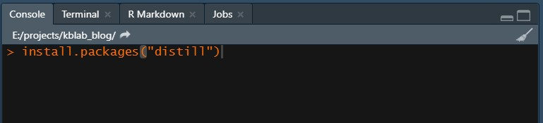
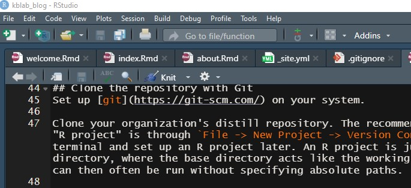

```{r setup, include=FALSE}
knitr::opts_chunk$set(echo = FALSE)
reticulate::use_condaenv("pytorch3k")
```

Distill is a publication format for scientific and technical writing, native to the web. You can learn more about using Distill for R Markdown at <https://rstudio.github.io/distill>. An example of a website built on this package is the [RStudio AI Blog](https://blogs.rstudio.com/ai/). More examples can be found [here](https://pkgs.rstudio.com/distill/articles/examples.html). 

The below guide will be expanded upon. Right now it's mostly a template.  

## R and RStudio setup
First things first, you will need to download and [install R](https://ftp.acc.umu.se/mirror/CRAN/). Secondly, it is highly recommended that you install the [RStudio IDE](https://rstudio.com/products/rstudio/download/#download) (integrated development environment). 

### Install packages

Once you have R and RStudio setup, open the IDE and install the [`distill`](https://pkgs.rstudio.com/distill/) package:

```{r, include=TRUE, echo=TRUE, eval=FALSE}
install.packages("distill")
```

```{r, fig.width=6, fig.height=1.5, fig.cap="Install the `distill` package in the console pane."}

```

## Clone the repository with Git
Set up [git](https://git-scm.com/) on your system. 

Clone your organization's distill repository. The recommended simple way of doing this while also setting up an "R project" is through `File -> New Project -> Version Control -> Git`. However, you can also clone from a terminal and set up an R project later. An R project is just an RStudio specific way of setting up a project directory, where the base directory acts like the working directory. It's convenient since most function calls can then often be run without specifying absolute paths.

## Create a new blog post
A new blog post can be created by using the [`create_post()`](https://pkgs.rstudio.com/distill/reference/create_post.html) function in the root directory of the project. To create a new post with the title "The Deepest Deeper Deep Learning Methods", you simply: 

```{r, include=TRUE, echo=TRUE, eval=FALSE}
library("distill")
create_post("The Deepest Deeper Deep Learning Methods")
```

This will create a new directory inside of the `_posts` directory with the name `{yyyy_mm_dd}-The-Deepest-Deeper-Deep-Learning-Methods`. It will always name the directory after the current date so that your blog posts are sorted chronologically. Inside of this directory you will find a newly generated `.Rmd`-file named something like  `thedeepestdeeperdeeplearningmethods.Rmd` where the actual content of the post goes. 

```{r, out.width="49%", fig.show='hold', fig.align="default"}
knitr::include_graphics(c("posts_folder.jpg","inside_posts.jpg"))
```

The pictures above display the appearance of the `_posts` folder after I created this introductory post. I named it "introduction". The title of the actual post when it is published does not have to be the same as the given name when creating the post. 

### Render the post for preview and publication

Once you've created your post and started adding content to it, you can generate the final product for preview or publication by "knitting" it. Knitting is R slang for generating the html/latex/pdf from Rmarkdown. The name comes from the package that does all the heavy lifting in the background ([`knitr`](https://yihui.org/knitr/)).

```{r, fig.width=6, fig.height=1.5, fig.cap="Press the `Knit` button to generate a preview and a publishable html document."}

```

When you click "knit" on your post's `.Rmd`-file, it will only render and update the contents related to your own post. While this is fine for generating a preview, ultimately we will also want to re-knit the `index.Rmd` file in the root directory. This will ensure that the listing of blog articles on the front page gets updated with your post. Do this either by opening `index.Rmd` and clicking on the "knit" button, or alternatively via

```{r, eval=FALSE, echo=TRUE}
rmarkdown::render_site()
```

This will only re-render the root-level `.Rmd` files (`index.Rmd` and `about.Rmd`) while leaving the blog articles intact. The reason being that old code frequently breaks due to environment changes and package updates. The *only* way of updating a blog post is thus by explicitly knitting it!

### Mix code with text in your post
In your posts you can organize and style the contents using Markdown Syntax. An informative and short reference guide for R Markdown can be found [here](https://rstudio.com/wp-content/uploads/2015/03/rmarkdown-reference.pdf). 

Code can be intermixed with text. We put code in so called *code chunks* which are preceded and followed by three backticks like so:

````python
`r ''````{r, echo=TRUE, eval=FALSE, code_folding=FALSE}
library(ggplot2)
df <- data.frame(x_sample = rnorm(n = 500, mean = 2, sd = 5))
ggplot(data = df, aes(x = x_sample)) +
  geom_histogram() +
  theme_light() +
  labs(x = "x",
       title = "A very pretty histogram") 
```
````

After the squiggly `{` bracket you specify the language, which can be for example `r`, `python` or `bash`. Optional chunk options are added afterwards which can control whether the code chunk e.g. is evaluated or not, whether the code and/or the output are displayed, as well as whether the code should be folded by default with an option to expand. Here is how a code chunk will actually be displayed when run properly:


```{r, echo=TRUE, code_folding=TRUE}
library(ggplot2)
df <- data.frame(x_sample = rnorm(n = 500, mean = 2, sd = 5))
ggplot(data = df, aes(x = x_sample)) +
  geom_histogram() +
  theme_light() +
  labs(x = "x",
       title = "A very pretty histogram") 
```

###  Combine R and Python in the same notebook
The RStudio IDE has support for both R and Python. Thanks to the [`reticulate`](https://rstudio.github.io/reticulate/)
package. By default, R will use the Python interpreter available on your system path. However, you can configure this inside of R with the help of [reticulate configuration functions](https://rstudio.github.io/reticulate/articles/versions.html) and choose any environment (including virtualenv and conda envs). 

To use python, simply:

````python
`r ''````{python, echo=TRUE, eval=FALSE, code_folding=FALSE}
# Dictionaries in an R IDE?!?! Amazing!
my_dict = {"a": 5, "b": 9, "c": 4}
my_key = "c"
print(f"The value for '{my_key}' is: {my_dict[my_key]}.")
```
````

When run with `echo=TRUE`, `eval=TRUE` (you can remove eval entirely since its default is `TRUE`) and `code_folding=FALSE` the above produces the following result:

```{python, echo=TRUE, code_folding=FALSE}
# Dictionaries in an R IDE?!?! Amazing!
my_dict = {"a": 5, "b": 9, "c": 4}
my_key = "c"
print(f"The value for '{my_key}' is: {my_dict[my_key]}.")
```

A conda Python environment named "pytorch3000" can be activated in the following manner in an R code chunk:

```{r, echo=TRUE, eval=FALSE, code_folding=FALSE}
reticulate::use_condaenv("pytorch3000")
```

However, be careful to ensure this chunk is run before the first time Python is called in your document. Otherwise it will fail to successfully change the Python version from whatever was the system default. 

### Access R objects from Python and vice versa

In R Markdown documents we can also directly access data and objects created in one language from the other language. To access python objects from R:

```{r, echo=TRUE, code_folding=FALSE}
library(reticulate)
paste("The value for", py$my_key, "is:", py$my_dict["c"])
```

And correspondingly from Python:

```{python, echo=TRUE, code_folding=FALSE}
import pandas as pd
df_dict = r.df # is a dictionary in Python: {x_sample: [..., ...]}
df = pd.DataFrame(df_dict)
df.head()
```