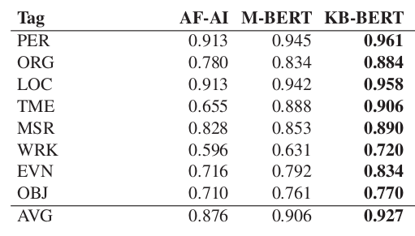
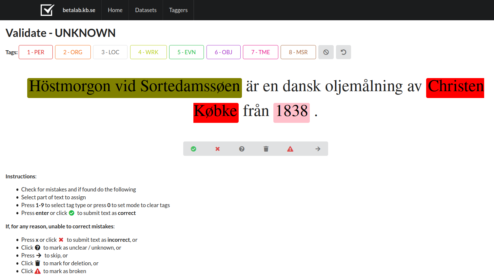

```{r setup, include=FALSE}
knitr::opts_chunk$set(echo = FALSE)
```

<style>
body {
text-align: justify}
</style>

## The Quest

In the spring of 2020, KBLab released a pre-trained BERT model for Swedish that was received with enthusiasm in the NLP community. In order to asses the performance of the model, it was fine-tuned on the SUC 3.0 dataset for Named Entity Recognition (NER). The model showed a good performance, better than other comparable models, but to a manual exam it was apparent that there were issues in the NER output. In addition, the performance for some classes, like PERSON and LOCATION, was really high (around 96%), while other classes like OBJECT and WORK OF ART were recognized significantly worse (72-77% accuracy). Of course, it might be the case that some types of entities are inherently harder to recognize, but the huge disparity pointed to some issues with the training data.  

```{r, out.width = "180%", fig.cap="The performance of KB-BERT on NER compared to Arbetsförmedlingen-AI's model and Google's Multilingual BERT. Table from Malmsten, M., Börjeson, L., & Haffenden, C. (2020). Playing with Words at the National Library of Sweden--Making a Swedish BERT. arXiv preprint arXiv:2007.01658."}

```

Sure enough, [SUC 3.0](https://spraakbanken.gu.se/en/resources/suc3) does not claim to be a gold standard dataset for NER. It is clearly stated in its documentation that the named entities, unlike morphology and part-of-speech tags, have been annotated using a tool called Sparv, so not by human annotators. Moreover, the dataset was not put together with NER as a main objective and there are huge imbalances between the different categories in terms of number of examples. This means that the BERT model was fine-tuned on a sub-optimal NER dataset, and no matter how good its language understanding was, it was not going to reach better performance levels. At this point we decided to fill a void in Swedish NLP and produce a gold standard NER dataset, which not only would be used to fine-tune our models but also published to benefit the community.

As any data scientist will confirm, annotating data is not an endeavor one embarks on lightly. It is way too time-consuming for a single person to produce enough data in a reasonable amount of time. In order for the model to be able to learn, it is necessary to feed it thousands of labeled examples for each class. This was clearly not something KBLab could do on its own. That is when we came up with the idea to ask our colleagues at the National Library for help.

### Crowdsourcing to the rescue

First we needed to put together a corpus. We thought we could go over SUC 3.0 and manually correct the annotations in order to obtain a gold standard, but we also wanted to create a new dataset that was stronger on the types of entities that would be useful in a library context, like publications, publishers and works of art in general. Since we wanted to be able to publish our dataset, it was also important that the texts belong to the public domain. We finally settled on Wikipedia articles about works of arts, music, books, films and artists of different kinds. We extracted them automatically from a Wikipedia dump and segmented them into sentences to be ready for annotation.  

The next step was to find a suitable annotation tool for named entities. We looked at some commercially available tools, but eventually our Lead Data scientist Martin decided to build a tool from scratch in order to have maximum control over the application. Annotators could navigate to an internal webpage on their browser and the sentences from the dataset would be presented to them, already pre-annotated by our KB-BERT model. The task was therefore to correct KB-BERT's annotation, and we hoped this would save some time compared to annotating from scratch, since the model in many cases makes the right prediction.  

```{r, fig.cap="Screenshot from our in-house NER annotation tool."}

```

Last but not least, we needed to recruit annotators. We knew we would have to run a pilot with a limited number of annotators to test the technical aspect and to receive some feedback about the annotation guidelines. Who best to perform this perilous task than a handful of our most hardened librarians? We turned to a unit who works daily with metadata and has a long experience of categorizing entities, albeit with a different purpose. To our great delight, eight colleagues immediately responded to our call to arms and volunteered to be part of the pilot.  

Annotating text material sounds like a trivial task but it most certainly isn't. Agreement among annotators is paramount to obtaining a coherent dataset that the models can learn from, while it is nearly impossible to foresee all improbable contexts and quirky use of language that natural language often presents. Just as an example, what kind of entity is the Ming Dinasty? Is it a PERSON, an ORGANISATION or is it maybe a TIME period? We couldn't add more categories to accommodate all the weird entities that popped up, so we had to reason together with our gifted annotators to find the best solution for each case and improve the guidelines.  

## To infinity and beyond 

We have now recently concluded the pilot after a very fruitful cooperation with our volunteers and are ready to go big by involving other units and departments in the project. As soon as we have enough annotated material we will curate the dataset the best we can and release it for everyone to use. So stay tuned!  

This crowdsourcing adventure has taught us a lot and we feel confident that we can apply the same concept to other areas. We have recently started working on a Swedish [Wav2vec 2.0](https://ai.facebook.com/blog/wav2vec-20-learning-the-structure-of-speech-from-raw-audio/), which is a speech recognition model developed at Facebook AI. We will need some hours of transcribed Swedish speech to fine-tune our model after the pre-training stage, and we are setting up a similar environment for transcription where our colleagues can work directly from their browser. In this case we aim to recruit people who already work with radio and other sound media, so they can be part of KBLab's effort to make KB's digital collections more accessible. And who knows what boons this library-wide collaborative spirit will bring in the future?