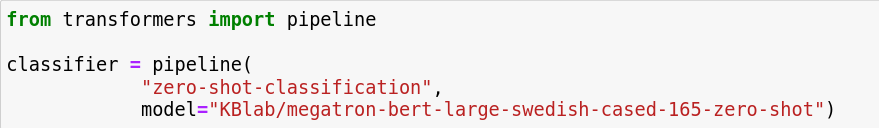
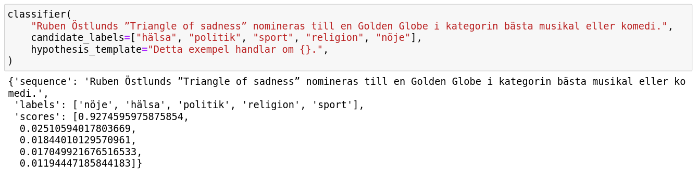
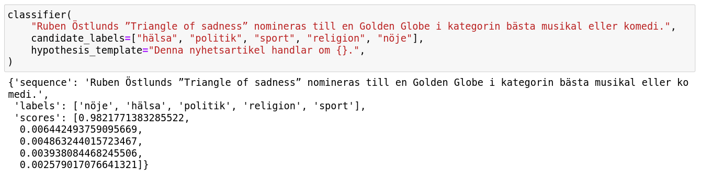
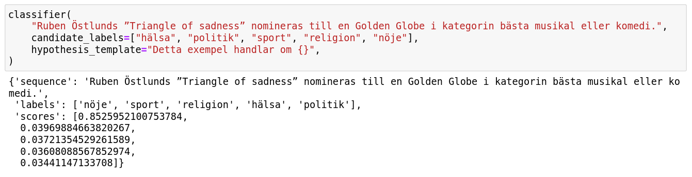

```{r setup, include=FALSE}
knitr::opts_chunk$set(echo = FALSE)
```

## What is zero-shot text classification?
The general goal of text classification is to assign a label to a piece of writing – whether it is a book review that we want to categorize as positive or negative, or a news article that we wish to check the topic of. Use cases are diverse and can range from topic classification and spam detection to sentiment analysis.

Usually, text classification is conducted with help of supervised machine learning, which means that we have to gather a sufficient number of labeled examples in order to train a classification model. The model learns relations between the sentences and the target labels and in turn can extrapolate from the examples it was exposed to during training to the unseen data.
For instance, if we want to use a sentiment classification model, we first have to feed it with a train portion of the data, which can contain movie or book reviews marked as negative, positive or neutral. Only after training, we can show new texts to the model and ask it to predict the sentiment of the previously unseen reviews. 

The procedure is straightforward, however, one issue is that it requires a labeled dataset for training. If we don’t have one, or cannot create one, generating the model is impossible. A solution suggested by Yin et al. in "Benchmarking zero-shot text classification: Datasets, evaluation and entailment approach” (2019) has its roots in changing perspective and treating classification task as a textual entailment problem. This approach allows us to use already available Natural Language Inference (NLI) models as zero-shot text classifiers. In zero-shot learning, models are not exposed to any task-specific examples, yet they are expected to generalize from the tasks they were trained on to others – in our case NLI models and various classification tasks. 

## How can Natural Language Inference models be used with zero-shot classification?
Natural Language Inference task is designed to test models’ reasoning capabilities. The aim of the task is to decide if there is a connection between two sentences, so-called premise and hypothesis, by checking whether a premise entails, contradicts or is not related to a hypothesis. For instance, the premise sentence “How do you know? All this is their information again.” entails the hypothesis “This information belongs to them.”, while the premise “but that takes too much planning” is contradictory to the hypothesis “It doesn’t take much planning.”. The idea behind using NLI models as zero-shot text classifiers is to look at input text that we want to categorize and its label as an entailment pair. If the premise entails the hypothesis, we can assume that the label is suitable for the text, otherwise we reject it. 

In order to be able to evaluate entailment pairs, we first have to reformulate potential classes into hypotheses with help of a template. Templates can be adjusted to specific tasks - for topic classification we could use the templates “This text is about {}.” or “This example is {}.”, while  “This text expresses {}.” might be appropriate for sentiment analysis.

The pairs can be constructed in the following manner:

**Premise**: "När Tutankhamons grav upptäcktes för 100 år sedan blev han världskänd. Faraon dog som 19-åring för över 3000 år sedan men när graven hittades var den helt intakt. Forskarna trodde först att Tutankhamon blivit mördad, men egyptologen Zahi Hawass tror sig vara nära att knäcka gåtan om den unga faraons död."

**Categories**: "sport", "religion", "nöje", "politik", "vetenskap"

**Template**: "Detta exempel handlar om {}." 

**First hypothesis**: "Detta exempel handlar om sport."

By inserting the labels into the template and evaluating each of the pairs, we can check which topic is most suitable for the premise.

## Training the Swedish model
To create the Swedish model for zero-shot text classification, we have experimented with fine-tuning models on different combinations of NLI tasks. From the models manually tested on a set of entailment pairs, the best results obtained Swedish BERT-large model with 340M parameters fine-tuned on two NLI datasets, which are part of the Swedish version of the GLUE benchmark (https://gluebenchmark.com/) – OverLim (https://huggingface.co/datasets/KBLab/overlim). The fine-tuning was conducted in two steps, first on The Stanford Question Answering Dataset (QNLI) and then on The Multi-Genre Natural Language Inference Corpus (MNLI). The model obtained 91.23% and 84.71% accuracy respectively.  

## Examples
The model is available on the KBLab’s HuggingFace page and can be used with 🤗 zero-shot classification pipeline. The pipeline offers a convenient API for using NLI models for classification. Let's have a look at some examples!

```{r, out.width = "180%"}

```
  
After loading the model, we have to specify a premise sentence and a list of categories that we wish to evaluate together with the input text. The output is a list over classes and corresponding probabilities calculated from probabilities for entailment and contradiction.

```{r, out.width = "180%"}

```

Defining a hypothesis template is not obligatory, however, setting a custom one can positively influence performance. In the example below, we can observe that the probability for the label “nöje” (entertainment) has increased when the template was changed to a more specific one. 

```{r, out.width = "180%"}

```
  
Let’s consider another example. Once the punctuation is removed, the probability decreases. 

```{r, out.width = "180%"}

```
  
With zero-shot approach training or fine-tuning models for text classification is not necessary. It can be therefore convenient if we are not in possession of labeled data, as the already trained NLI models can be used off-the-shelf. In addition, since the categories are not solely limited to ones determined at the point of training of a model, using a NLI-based zero-shot text classification pipeline gives more flexibility in terms of choice of candidate labels.

### Links about zero-shot text classification:

"Benchmarking zero-shot text classification: Datasets, evaluation and entailment approach”, Yin et al. article : https://aclanthology.org/D19-1404/ 

NLI model for Swedish: https://huggingface.co/KBLab/megatron-bert-large-swedish-cased-165-zero-shot

Information about HuggingFace pipelines: https://huggingface.co/docs/transformers/v4.26.0/en/main_classes/pipelines

