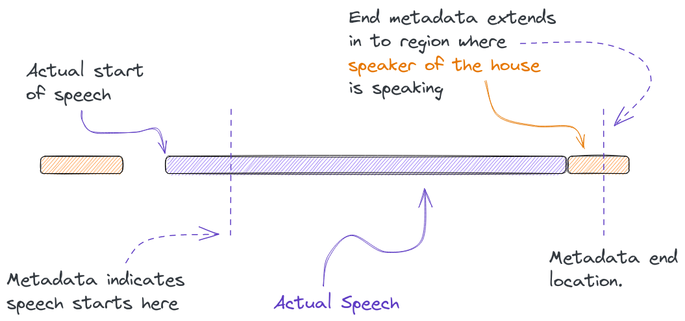

```{r echo=FALSE}
library(dplyr)

df_to_js <- function(x, var_name = "data", ...){
  # Source: https://www.aliciaschep.com/blog/js-rmarkdown/#fnref1
  json_data <- jsonlite::toJSON(x, ...)
  
  htmltools::tags$script(paste0("var ",var_name," = ", json_data, ";"))
}

df <- arrow::read_parquet("/home/faton/projects/audio/riksdagen_anforanden/data/df_final_metadata.parquet")

df <- df %>%
  mutate(debateurl_timestamp_riks = paste0("https://www.riksdagen.se/views/pages/embedpage.aspx?did=", dokid, "&start=", start, "&end=", end),
         anftext_short = paste0(stringr::word(anftext, start=1, end=20, sep=" "), "..."))

df_data <- df %>%
  filter(dokid == "H9C120220512fs") %>%
  select(dokid, start, end, start_adjusted, end_adjusted, speaker, party, speaker_audio_meta, anftext_short)

# df_to_js(list("asdf" = df_data[1,], "asdf2" = df_data[1,]))
df_to_js(df_data, var_name = "data_example")
```

The Riksdag is Sweden's legislature. The 349 members of the Riksdag regularly gather to debate in [the Chamber](https://www.riksdagen.se/en/how-the-riksdag-works/the-work-of-the-riksdag/debates-and-decisions-in-the-chamber/) of the [Parliament House](https://en.wikipedia.org/wiki/Parliament_House,_Stockholm). These debates are recorded and published to the Riksdag's [Web TV](https://www.riksdagen.se/sv/webb-tv/). For the past 20 years the Riksdag's media recordings have been enriched with further metadata, including tags for the start and the duration of each speech, along with their corresponding transcripts. Speaker lists are added to each debate, allowing viewers to navigate and jump between speeches easier ^[An example can be seen here: https://www.riksdagen.se/sv/webb-tv/video/partiledardebatt/partiledardebatt_HAC120230118pd]. This metadata also allows linking members of parliament and ministers with the debates they have participated in. 

<aside>
```{r out.width="360px", echo=FALSE}
url <- "https://www.riksdagen.se/imagevault/publishedmedia/r75t6jvj5ecigmglskqg/kammaren-votering-0131-ok.jpg"
knitr::include_graphics(url)
```
The Chamber.  

<i>Photo: Melker Dahlstrand /The Swedish Parliament</i>
</aside>

Happening upon these recordings and seeing them linked to such rich metadata, we were curious to learn if the Riksdag had planned to make them available through its [open data platform](https://data.riksdagen.se/) and APIs. We e-mailed them to inquire whether an audio/media file API was in the plans, to which they responded that such an API in fact already did and does exist, although they had yet to settle on a good way of communicating this service to the public. 

Part of our work here at KBLab involves training Swedish *Automatic Speech Recognition* (ASR) models capable of transcribing speech to text ^[We release these models freely and openly. See our Wav2vec2 model: https://huggingface.co/KBLab/wav2vec2-large-voxrex-swedish]. Here, audio datasets with annotated transcriptions play an especially important part for quality. Unfortunately such datasets are hard to come by for Swedish. The combined total of current available datasets with annotated transcriptions number somewhere in the *hundreds* of hours. 

Decades of debates from the Riksdag present a golden opportunity to increase this quantity by a factor of tenfold or more. The wealth of dialects and accents, along with the breadth of metadata covering electoral districts, birth year and the sex of members of parliament may serve to not only improve ASR systems, but also to enable research on the weaknesses and biases of both current and future models. 

However, in order to get the speeches and transcripts properly aligned so they can be brought to a suitable and workable format, we first need to ensure the region of audio within a debate representing a speech actually matches the written transcript. Additionally no other speakers should ideally be present in this window.

## The importance of metadata

When assessing the quality of the available metadata from debates, we found most of the material from 2012 and forward was generally accurate and of high quality. However, the required degree of precision of metadata always depends on one's use case. And in our case it was important that only one speaker -- the one making the speech -- be present in the indicated window. With this in mind, it soon became evident that a certain level of adjustment of the existing metadata was required. Illustrating this with an example below, we see that the Riksdag's metadata (**right video**) tends to include parts where the speaker of the house talks. The **left video** shows the automatically generated metadata from the method we developed for locating and segmenting speeches. We employed [speaker diarization](https://en.wikipedia.org/wiki/Speaker_diarisation) to more precisely pinpoint when a speaker starts and stops speaking. 

<aside>
Both videos below will update at the same time when pressing "Next debate"/"Previous debate". The speeches are set to begin and end playing at the "start" and "end" of both metadata sources. Play them one after another to see how they compare in terms of speech segmentation.
</aside>


::: l-page
```{=html}
<div class="videobox">
  <iframe id="videokb" src="https://www.riksdagen.se/views/pages/embedpage.aspx?did=H9C120220512fs&start=97.5&end=154" allowfullscreen="" scrolling="yes" title="Partiledardebatt 18 januari 2023 från Riksdagen om Partiledardebatt" style="width: 510px; height: 288px; border: 0´; margin-bottom: 0em;"></iframe>
  </video>
  <div class="metabox">
    <form action="">
      <input type="button" id="prevspeech" value="Previous speech"/>
      <input type="button" id="nextspeech" value="Next speech"/>
    </form>
    <h3>Adjusted metadata (KBLab)</h3>
    <p class="beginning"><u>Beginning of official transcript:</u></p>
    <p id="speechtranscript">Fru talman! Njutningsäktenskap låter härligt. Men Uppdrag granskning visade att det är religiöst sanktionerat koppleri. Det är sexhandel, det är...</p>
    <p id="metadatastart"><b>Start:</b> 00:01:37.5  <b>End:</b> 00:02:34.0</p>
    <p id="speaker1"><b>Speaker:</b> Ann-Sofie Alm (M)</p>
    <p><small><i>Source: Sveriges riksdag.</i></small></p>
  </div>
</div>

<div class="videobox">
  <iframe id="videoriks" src="https://www.riksdagen.se/views/pages/embedpage.aspx?did=H9C120220512fs&start=94&end=157" allowfullscreen="" scrolling="yes" title="Partiledardebatt 18 januari 2023 från Riksdagen om Partiledardebatt" style="width: 510px; height: 288px; border: 0; margin-bottom: 0em;"></iframe>
  <div class="metabox">
    <form action="">
      <input type="button" id="prevspeech2" value="Previous speech"/>
      <input type="button" id="nextspeech2" value="Next speech"/>
    </form>
    <h3>The Riksdag's metadata</h3>
    <p class="beginning"><u>Beginning of official transcript:</u></p>
    <p id="speechtranscript2">Fru talman! Njutningsäktenskap låter härligt. Men Uppdrag granskning visade att det är religiöst sanktionerat koppleri. Det är sexhandel, det är...</p>
    <p id="metadatastart2"><b>Start:</b> 00:01:34.0  <b>End:</b> 00:02:37.0</p>
    <p id="speaker2"><b>Speaker:</b> Ann-Sofie Alm (M)</p>
    <p><small><i>Source: Sveriges riksdag.</i></small></p>
  </div>
</div>
```
:::

Modern Riksdag metadata, such as the debate above, serve as a good benchmark against which we can evaluate our fully automated method. Should our method -- using only official transcripts and audio -- be able to roughly match the segmentation quality of these more recent debates, we can be reasonably certain it can also fare well when applied on older materials.

Below we display speeches from 10 sampled debates from before 2012-01-01 -- a period where metadata quality tends to be shakier. The first and the second debate, "Regeringens skärpning av migrationspolitiken" and "Kvalitet i förskolan m.m.", contain large errors in the Riksdag's metadata when it comes to start and end times. It appears the metadata in these debates have shifted to be off by an entire speech. In addition to the above, we found mismatches between the indicated names of the speakers in text form and in the internal id-system that the Riksdag use to identify members of parliament. The more accurate field is `intresent_id` which lists the id number of the speaker, whereas the `text` field which lists the name in textual form at times can be misleading. 

Likely this is either an off by one error during data entry, a joining of disparate datasets gone wrong, or some post-processing mistake. Since we found the `intressent_id` field to be reliable, we used the id's to fetch the names and information of parliament members from a separate data file the Riksdag provides in their open data platform ^[The file Sagtochgjort.csv.zip here: https://data.riksdagen.se/data/ledamoter/]. 

```{r echo=FALSE}
set.seed(1341)
df_debatedata <- df %>%
  filter(debatedate < "2012-01-01") %>% 
  filter(dokid %in% sample(dokid, size = 10)) %>%
  select(dokid, start, end, start_adjusted, end_adjusted, speaker, party, speaker_audio_meta, anftext_short, start_diff, end_diff) %>%
  group_by(dokid) %>%
  tidyr::nest()

names(df_debatedata$data) <- df_debatedata$dokid
df_to_js(df_debatedata$data, var_name = "data_debate")
```

::: l-page
```{=html}
<div class="videobox">
  <iframe id="videokb_deb" src="https://www.riksdagen.se/views/pages/embedpage.aspx?did=GR10298&start=755.4&end=1001.9" allowfullscreen="" scrolling="yes" title="Partiledardebatt 18 januari 2023 från Riksdagen om Partiledardebatt" style="width: 510px; height: 288px; border: 0´; margin-bottom: 0em;"></iframe>
  </video>
  <div class="metabox_debate">
    <form action="">
      <input type="button" id="prevspeech3" value="Previous speech"/>
      <input type="button" id="nextspeech3" value="Next speech"/>
      <input type="button" id="prevdebate1" value="Previous debate" style="margin-left: 80px;"/>
      <input type="button" id="nextdebate1" value="Next debate"/>
    </form>
    <h3>Adjusted metadata (KBLab)</h3>
    <p class="beginning"><u>Beginning of official transcript:</u></p>
    <p id="speechtranscript3">Herr talman! Tyvärr tvingas jag notera att jag inte fick svar på de frågor jag ställde, men jag kan upprepa...</p>
    <p id="metadatastart3"><b>Start:</b> 00:12:35.4  <b>End:</b> 00:16:41.9</p>
    <p id="speaker3"><b>Speaker:</b> Erik Ullenhag (L)</p>
    <p><small><i>Source: Sveriges riksdag.</i></small></p>
  </div>
</div>

<div class="videobox">
  <iframe id="videoriks_deb" src="https://www.riksdagen.se/views/pages/embedpage.aspx?did=GR10298&start=0&end=312" allowfullscreen="" scrolling="yes" title="Partiledardebatt 18 januari 2023 från Riksdagen om Partiledardebatt" style="width: 510px; height: 288px; border: 0; margin-bottom: 0em;"></iframe>
  <div class="metabox_debate">
    <form action="">
      <input type="button" id="prevspeech4" value="Previous speech"/>
      <input type="button" id="nextspeech4" value="Next speech"/>
      <input type="button" id="prevdebate2" value="Previous debate" style="margin-left: 80px;"/>
      <input type="button" id="nextdebate2" value="Next debate"/>
    </form>
    <h3>The Riksdag's metadata</h3>
    <p class="beginning"><u>Beginning of official transcript:</u></p>
    <p id="speechtranscript4">Herr talman! Tyvärr tvingas jag notera att jag inte fick svar på de frågor jag ställde, men jag kan upprepa...</p>
    <p id="metadatastart4"><b>Start:</b> 00:00:00.0  <b>End:</b> 00:05:12.0</p>
    <p id="speaker4"><b>Speaker:</b> Barbro Holmberg (S)</p>
    <p><small><i>Source: Sveriges riksdag.</i></small></p>
  </div>
</div>
```
:::


* The alignment is achieved using only an official transcript, without the reliance on any further metadata.

Why is it important?

## The Riksdag's speeches in numbers


| Source                 |   Total duration of debates (hours) |
|:-----------------------|------------------:|
| The Riksdag's metadata |           6398.4  |
| Audio files            |           6361.4  |


| Source                    |   Total speech duration of debates |
|:--------------------------|------------------:|
| The Riksdag's metadata    |           6742.15 |
| Adjusted metadata (KBLab) |           5858.36 |

Our method for finding which debates had associated media files, was to first download the speeches in text form from ["Riksdagen's anföranden"](https://data.riksdagen.se/data/anforanden/). Out of more than 300000 available speeches from 1993/94 and onwards:

* **133130** speeches belonged to debates that had downloadable audio files in the Riksdag's media API.
* Of the above only **122525** speeches had valid audio files, or were found to be at all present in the audio files.
* After applying additional quality filters **117725** speeches remained. These filters included removing: 
  * duplicate transcripts attributed to different speakers. 
  * two or more speeches being attributed with the same starting or ending time.
  * debates starting and ending in the middle of speeches.
  * sudden jumps/cuts/edits in the audio while a speech was in progress. 
  * speeches shorter than 25 seconds in duration (the margins of error are narrower for shorter speeches).

### Metadata statistics grouped by year

::: l-body-outset
```{r echo=FALSE}
df %>%
  mutate(year = lubridate::year(debatedate)) %>%
  group_by(year) %>%
  summarise("Total duration (hours)" = round(sum(duration_segment) / 3600, digits = 2),
            "Median start difference (seconds)" = round(median(start_diff), digits=2),
            "Median end difference (seconds)" = round(median(end_diff), digits=2)) %>%
  rename(Year = year) %>%
  rmarkdown::paged_table(options = list(cols.print=4, rows.print=8))
```
:::

### Most and least intelligible speakers

::: l-body-outset
```{r echo=FALSE}
df_bottom <- arrow::read_parquet("/home/faton/projects/audio/riksdagen_anforanden/bottom30_bleu.parquet")
rmarkdown::paged_table(df_bottom)
``` 
:::

::: l-body-outset
```{r echo=FALSE}
df_top <- arrow::read_parquet("/home/faton/projects/audio/riksdagen_anforanden/top30_bleu.parquet")
rmarkdown::paged_table(df_top)
```
:::


## The speech finder method

```{r fig.retina = 1, echo=FALSE, fig.alt="An illustrative sketch displaying how official metadata is not always aligned with the actual start of a speech in an audio file."}

```

```{r fig.retina = 2, echo=FALSE, fig.alt="An illustrative sketch with text, describing in 5 steps how KBLab's method for finding speeches in audio files works. Step 1 is to use automatic speech recognition to transcribe an audio file. Step 2 is to fuzzy string match the ASR output against official transcripts to get approximate start and end locations for a speech. Step 3 is to perform speaker diarization to partition the audio file in to segments of different speakers. Step 4 is to assign speaker diarization segments with high degree of overlap with the speeches associated with the approximate start and end locations as predicted by fuzzy string match. Step 5 is to use start and end locations of the assigned segments as the new predictions of metadata for when a speech begins and ends."}
knitr::include_graphics("speech_finder_method.png")
```

## Evaluation of metadata quality

::: l-page
```{r fig.retina = 2, echo=FALSE}
knitr::include_graphics("monthly_bleu.jpg")
```
:::


::: l-page
```{r fig.show="hold", out.width="50%", fig.retina = 2, fig.cap="Caption.", fig.align="center", echo=FALSE}
knitr::include_graphics(c("start_diff.jpg", "end_diff.jpg"))
```
:::

## Suggested usage

* Academic research
* Automatic speech recognition.
* Diarization.
* Bias research.
* The general "speech finding" method proposed here can be reused in other contexts.

## Contribute to RixVox

* Dialect tagging
* Accent tagging
* Create links of members of parliament and ministers to Wikidata.

## RixVox in the future


```{js speech, echo=FALSE}
var metadata = data_example;

var i = 0;

transcript1 = document.getElementById("speechtranscript");
transcript2 = document.getElementById("speechtranscript2");
metadata1 = document.getElementById("metadatastart");
metadata2 = document.getElementById("metadatastart2");
speaker1 = document.getElementById("speaker1");
speaker2 = document.getElementById("speaker2");

// Initialize transcripts
transcript1.textContent = metadata[i].anftext_short;
transcript2.textContent = metadata[i].anftext_short;

//add event listener
prevspeech.addEventListener('click', prevClickEvent);
prevspeech2.addEventListener('click', prevClickEvent);
nextspeech.addEventListener('click', nextClickEvent);
nextspeech2.addEventListener('click', nextClickEvent);

function embedLinkGetter(dokid, start, end){
  base_url = "https://www.riksdagen.se/views/pages/embedpage.aspx?did=";
  embed_url = base_url + dokid + "&start=" + start + "&end=" + end;
  return embed_url
}

function changeVideo(video1_id, video2_id, is_debate=false){
  if (is_debate) {
    document.getElementById(video1_id).src = embedLinkGetter(debate_ids[k], metadata_debate[j].start_adjusted, metadata_debate[j].end_adjusted);
    document.getElementById(video2_id).src = embedLinkGetter(debate_ids[k], metadata_debate[j].start, metadata_debate[j].end);
  } else {
    document.getElementById(video1_id).src = embedLinkGetter(metadata[i].dokid, metadata[i].start_adjusted, metadata[i].end_adjusted);
    document.getElementById(video2_id).src = embedLinkGetter(metadata[i].dokid, metadata[i].start, metadata[i].end);
  }
}

function secondsToHourMinSec(seconds, begin=11, end=21){
  return new Date(seconds * 1000).toISOString().slice(begin, end);
}

function editMetadata(i, is_debate=false){
  if (is_debate){
    console.log("is debate here");
    // The orange/yellow boxes with debate buttons
    transcript3.textContent = metadata_debate[i].anftext_short;
    transcript4.textContent = metadata_debate[i].anftext_short;
    metadata3.innerHTML = "<b>Start:</b> " + secondsToHourMinSec(metadata_debate[i].start_adjusted);
    metadata3.innerHTML += "<b>  End:</b> " + secondsToHourMinSec(metadata_debate[i].end_adjusted);
    metadata4.innerHTML = "<b>Start:</b> " + secondsToHourMinSec(metadata_debate[i].start);
    metadata4.innerHTML += "<b>  End:</b> " + secondsToHourMinSec(metadata_debate[i].end); 
    speaker3.innerHTML = "<b>Speaker: </b> " + metadata_debate[i].speaker + " (" + metadata_debate[i].party + ")";
    speaker4.innerHTML = "<b>Speaker: </b> " + metadata_debate[i].speaker_audio_meta; 
  } else {
    transcript1.textContent = metadata[i].anftext_short;
    transcript2.textContent = metadata[i].anftext_short;
    metadata1.innerHTML = "<b>Start:</b> " + secondsToHourMinSec(metadata[i].start_adjusted);
    metadata1.innerHTML += "<b>  End:</b> " + secondsToHourMinSec(metadata[i].end_adjusted);
    metadata2.innerHTML = "<b>Start:</b> " + secondsToHourMinSec(metadata[i].start);
    metadata2.innerHTML += "<b>  End:</b> " + secondsToHourMinSec(metadata[i].end); 
    speaker1.innerHTML = "<b>Speaker: </b> " + metadata[i].speaker + " (" + metadata[i].party + ")";
    speaker2.innerHTML = "<b>Speaker: </b> " + metadata[i].speaker_audio_meta; 
  }
}

function prevClickEvent() {
  if (i > 0) {
    i--;
    changeVideo("videokb", "videoriks", is_debate=false);
  }

  editMetadata(i);
}

function nextClickEvent() {
  if (i < (metadata.length - 1)) {
    i++;
    changeVideo("videokb", "videoriks", is_debate=false);
  }
  
  editMetadata(i);
}
```


```{js debate, echo=FALSE}
var j = 0;
var k = 0;

debate_ids = Object.keys(data_debate);
metadata_debate = data_debate[debate_ids[k]];
transcript3 = document.getElementById("speechtranscript3");
transcript4 = document.getElementById("speechtranscript4");
metadata3 = document.getElementById("metadatastart3");
metadata4 = document.getElementById("metadatastart4");
speaker3 = document.getElementById("speaker3");
speaker4 = document.getElementById("speaker4");

// Initialize transcripts
transcript3.textContent = metadata_debate[j].anftext_short;
transcript4.textContent = metadata_debate[j].anftext_short;

//add event listener
prevspeech3.addEventListener('click', prevSpeechEvent);
prevspeech4.addEventListener('click', prevSpeechEvent);
nextspeech3.addEventListener('click', nextSpeechEvent);
nextspeech4.addEventListener('click', nextSpeechEvent);
prevdebate1.addEventListener('click', prevDebateEvent);
prevdebate2.addEventListener('click', prevDebateEvent);
nextdebate1.addEventListener('click', nextDebateEvent);
nextdebate2.addEventListener('click', nextDebateEvent);

function embedLinkGetter(dokid, start, end){
  base_url = "https://www.riksdagen.se/views/pages/embedpage.aspx?did=";
  embed_url = base_url + dokid + "&start=" + start + "&end=" + end;
  return embed_url
}

function prevSpeechEvent() {
  if (j > 0) {
    j--;
    changeVideo("videokb_deb", "videoriks_deb", is_debate=true);
  }

  editMetadata(j, is_debate=true);
}

function nextSpeechEvent() {
  if (j < (metadata.length - 1)) {
    j++;
    changeVideo("videokb_deb", "videoriks_deb", is_debate=true);
  }
  
  editMetadata(j, is_debate=true);
}

function prevDebateEvent() {
  if (k > 0){
    k--;
    j = 0;
    metadata_debate = data_debate[debate_ids[k]];
    changeVideo("videokb_deb", "videoriks_deb", is_debate=true);
  }
  
  editMetadata(j, is_debate=true);
}

function nextDebateEvent() {
  if (k < (debate_ids.length - 1)){
    k++;
    j = 0;
    metadata_debate = data_debate[debate_ids[k]];
    changeVideo("videokb_deb", "videoriks_deb", is_debate=true);
  }
  
  editMetadata(j, is_debate=true);
}
```


```{css echo=FALSE}
.videobox{
    float:left;
    align-content: center;
    margin-right:20px;
    border:2px;
    word-wrap: break-word;
    max-width: 510px;
}
.clear{
    clear:both;
}

.metabox{
    background-color: #d1d1e0;
    margin: 0px;
}

.metabox > * {
  padding-left: 6px;
}

.metabox_debate{
    background-color: #ffdab3;
    margin: 0px;
}

.metabox_debate > * {
  padding-left: 6px;
}

.beginning {
  margin-bottom: 4px;
}

```
