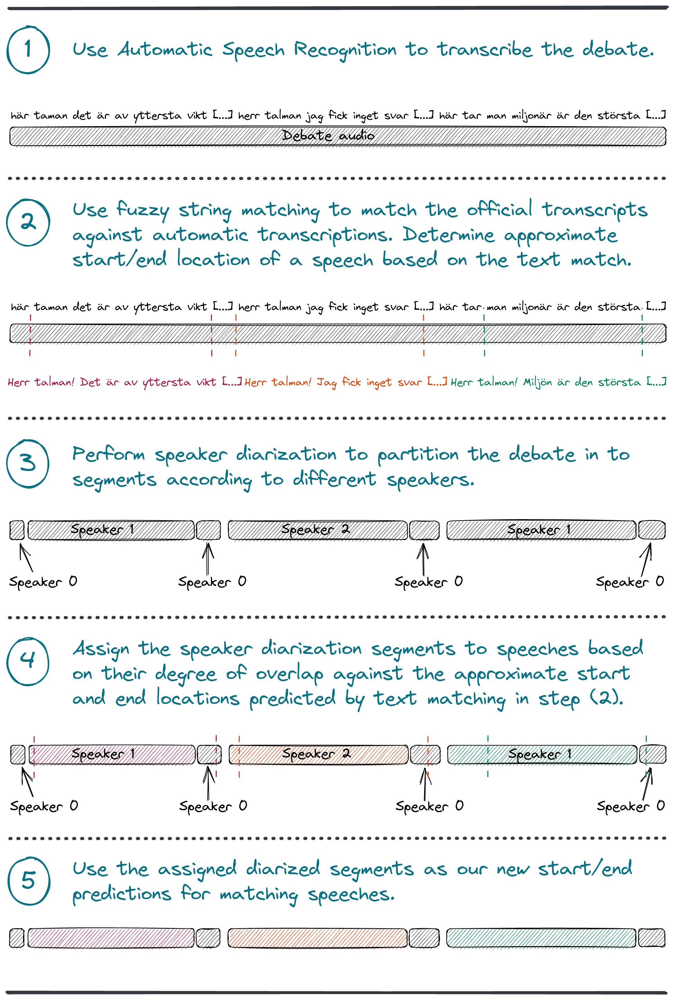
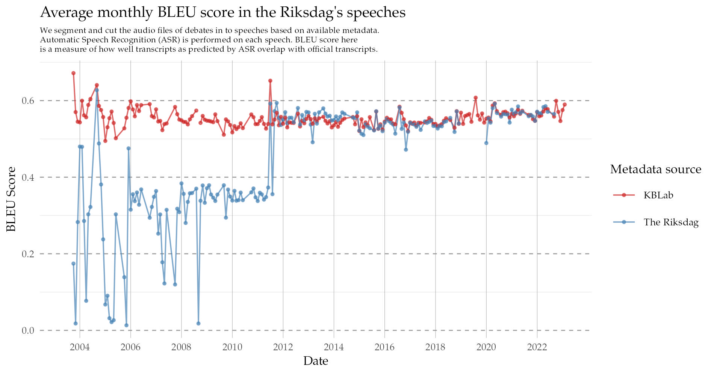

```{r echo=FALSE}
library(dplyr)

df_to_js <- function(x, var_name = "data", ...){
  # Source: https://www.aliciaschep.com/blog/js-rmarkdown/#fnref1
  json_data <- jsonlite::toJSON(x, ...)
  
  htmltools::tags$script(paste0("var ",var_name," = ", json_data, ";"))
}

df <- arrow::read_parquet("/home/faton/projects/audio/riksdagen_anforanden/data/df_final_metadata.parquet")

df <- df %>%
  mutate(debateurl_timestamp_riks = paste0("https://www.riksdagen.se/views/pages/embedpage.aspx?did=", dokid, "&start=", start, "&end=", end),
         anftext_short = paste0(stringr::word(anftext, start=1, end=20, sep=" "), "..."))

df_data <- df %>%
  filter(dokid == "H9C120220512fs") %>%
  select(dokid, start, end, start_adjusted, end_adjusted, speaker, party, speaker_audio_meta, anftext_short)

# df_to_js(list("asdf" = df_data[1,], "asdf2" = df_data[1,]))
df_to_js(df_data, var_name = "data_example")
```

The Riksdag is Sweden's legislature. The 349 members of the Riksdag regularly gather to debate in [the Chamber](https://www.riksdagen.se/en/how-the-riksdag-works/the-work-of-the-riksdag/debates-and-decisions-in-the-chamber/) of the [Parliament House](https://en.wikipedia.org/wiki/Parliament_House,_Stockholm). These debates are recorded and published to the Riksdag's [Web TV](https://www.riksdagen.se/sv/webb-tv/). For the past 20 years the Riksdag's media recordings have been enriched with further metadata, including tags for the start and the duration of each speech, along with their corresponding transcripts. Speaker lists are added to each debate, allowing viewers to navigate and jump between speeches easier ^[An example can be seen here: https://www.riksdagen.se/sv/webb-tv/video/partiledardebatt/partiledardebatt_HAC120230118pd]. This metadata also allows linking members of parliament and ministers with the debates they have participated in. 

<aside>
```{r out.width="360px", echo=FALSE}
url <- "https://www.riksdagen.se/imagevault/publishedmedia/r75t6jvj5ecigmglskqg/kammaren-votering-0131-ok.jpg"
knitr::include_graphics(url)
```
The Chamber.  

<i>Photo: Melker Dahlstrand /The Swedish Parliament</i>
</aside>

Happening upon these recordings and seeing them linked to such rich metadata, we were curious to learn if the Riksdag had planned to make them available through its [open data platform](https://data.riksdagen.se/) and APIs. We e-mailed them to inquire whether an audio/media file API was in the plans, to which they responded that such an API in fact already did and does exist, although they had yet to settle on a good way of communicating this service to the public. 

Part of our work here at KBLab involves training Swedish *Automatic Speech Recognition* (ASR) models capable of transcribing speech to text ^[We release these models freely and openly. See our Wav2vec2 model: https://huggingface.co/KBLab/wav2vec2-large-voxrex-swedish]. Here, audio datasets with annotated transcriptions play an especially important part for quality. Unfortunately such datasets are hard to come by for Swedish. The combined total of current available datasets with annotated transcriptions number somewhere in the *hundreds* of hours. 

Decades of debates from the Riksdag present a golden opportunity to increase this quantity by a factor of tenfold or more. The wealth of dialects and accents, along with the breadth of metadata covering electoral districts, birth year and the gender of members of parliament may serve to not only improve ASR systems, but also to enable research on the weaknesses and biases of both current and future models. 

However, in order to get the speeches and transcripts properly aligned so they can be brought to a suitable and workable format, we first need to ensure the region of audio within a debate representing a speech actually matches the written transcript. Additionally no other speakers should ideally be present in this window.

## The importance of metadata

When assessing the quality of the available metadata from debates, we found most of the material from 2012 and forward was generally accurate and of high quality. However, the required degree of precision of metadata always depends on one's use case. And in our case it was important that only one speaker -- the one making the speech -- be present in the indicated window. With this in mind, it soon became evident that a certain level of adjustment of the existing metadata was required. Illustrating this with an example below, we see that the Riksdag's metadata (**right video**) tends to include parts where the speaker of the house talks. The **left video** shows the automatically generated metadata from the method we developed for locating and segmenting speeches. We employed [speaker diarization](https://en.wikipedia.org/wiki/Speaker_diarisation) to more precisely pinpoint when a speaker starts and stops speaking. 

<aside>
Both videos below will update at the same time when pressing "Next debate"/"Previous debate". The speeches are set to begin and end playing at the "start" and "end" of both metadata sources. Play them one after another to see how they compare in terms of speech segmentation.
</aside>


::: l-page
```{=html}
<div class="videobox">
  <iframe id="videokb" src="https://www.riksdagen.se/views/pages/embedpage.aspx?did=H9C120220512fs&start=97.5&end=154" allowfullscreen="" scrolling="yes" title="Partiledardebatt 18 januari 2023 från Riksdagen om Partiledardebatt" style="width: 510px; height: 288px; border: 0´; margin-bottom: 0em;"></iframe>
  </video>
  <div class="metabox">
    <form action="">
      <input type="button" id="prevspeech" value="Previous speech"/>
      <input type="button" id="nextspeech" value="Next speech"/>
    </form>
    <h3>Adjusted metadata (KBLab)</h3>
    <p class="beginning"><u>Beginning of official transcript:</u></p>
    <p id="speechtranscript">Fru talman! Njutningsäktenskap låter härligt. Men Uppdrag granskning visade att det är religiöst sanktionerat koppleri. Det är sexhandel, det är...</p>
    <p id="metadatastart"><b>Start:</b> 00:01:37.5  <b>End:</b> 00:02:34.0</p>
    <p id="speaker1"><b>Speaker:</b> Ann-Sofie Alm (M)</p>
    <p><small><i>Source: Sveriges riksdag.</i></small></p>
  </div>
</div>

<div class="videobox">
  <iframe id="videoriks" src="https://www.riksdagen.se/views/pages/embedpage.aspx?did=H9C120220512fs&start=94&end=157" allowfullscreen="" scrolling="yes" title="Partiledardebatt 18 januari 2023 från Riksdagen om Partiledardebatt" style="width: 510px; height: 288px; border: 0; margin-bottom: 0em;"></iframe>
  <div class="metabox">
    <form action="">
      <input type="button" id="prevspeech2" value="Previous speech"/>
      <input type="button" id="nextspeech2" value="Next speech"/>
    </form>
    <h3>The Riksdag's metadata</h3>
    <p class="beginning"><u>Beginning of official transcript:</u></p>
    <p id="speechtranscript2">Fru talman! Njutningsäktenskap låter härligt. Men Uppdrag granskning visade att det är religiöst sanktionerat koppleri. Det är sexhandel, det är...</p>
    <p id="metadatastart2"><b>Start:</b> 00:01:34.0  <b>End:</b> 00:02:37.0</p>
    <p id="speaker2"><b>Speaker:</b> Ann-Sofie Alm (M)</p>
    <p><small><i>Source: Sveriges riksdag.</i></small></p>
  </div>
</div>
```
:::

Modern Riksdag metadata, such as the debate above, serve as a good benchmark against which we can evaluate our fully automated method. Should our method -- using only official transcripts and audio -- be able to roughly match the segmentation quality of these more recent debates, we can be reasonably certain it can also fare well when applied on older materials.

Below we display speeches from 10 sampled debates from before 2012-01-01 -- a period where metadata quality tends to be shakier. The first and the second debate, "Regeringens skärpning av migrationspolitiken" and "Kvalitet i förskolan m.m.", contain large errors in the Riksdag's metadata when it comes to start and end times. It appears the metadata in these debates have shifted to be off by an entire speech. In addition to the above, we found mismatches between the indicated names of the speakers in text form and in the internal id-system that the Riksdag use to identify members of parliament. The more accurate field is `intresent_id` which lists the id number of the speaker, whereas the `text` field which lists the name in textual form at times can be misleading. 

Likely this is either an off by one error during data entry, a joining of disparate datasets gone wrong, or some post-processing mistake. Since we found the `intressent_id` field to be reliable, we used the id's to fetch the names and information of parliament members from a separate data file the Riksdag provides in their open data platform ^[The file Sagtochgjort.csv.zip here: https://data.riksdagen.se/data/ledamoter/]. 

```{r echo=FALSE}
set.seed(1341)
df_debatedata <- df %>%
  filter(debatedate < "2012-01-01") %>% 
  filter(dokid %in% sample(dokid, size = 10)) %>%
  select(dokid, start, end, start_adjusted, end_adjusted, speaker, party, speaker_audio_meta, anftext_short, start_diff, end_diff) %>%
  group_by(dokid) %>%
  tidyr::nest()

names(df_debatedata$data) <- df_debatedata$dokid
df_to_js(df_debatedata$data, var_name = "data_debate")
```

::: l-page
```{=html}
<div class="videobox">
  <iframe id="videokb_deb" src="https://www.riksdagen.se/views/pages/embedpage.aspx?did=GR10298&start=755.4&end=1001.9" allowfullscreen="" scrolling="yes" title="Partiledardebatt 18 januari 2023 från Riksdagen om Partiledardebatt" style="width: 510px; height: 288px; border: 0´; margin-bottom: 0em;"></iframe>
  </video>
  <div class="metabox_debate">
    <form action="">
      <input type="button" id="prevspeech3" value="Previous speech"/>
      <input type="button" id="nextspeech3" value="Next speech"/>
      <input type="button" id="prevdebate1" value="Previous debate" style="margin-left: 80px;"/>
      <input type="button" id="nextdebate1" value="Next debate"/>
    </form>
    <h3>Adjusted metadata (KBLab)</h3>
    <p class="beginning"><u>Beginning of official transcript:</u></p>
    <p id="speechtranscript3">Herr talman! Tyvärr tvingas jag notera att jag inte fick svar på de frågor jag ställde, men jag kan upprepa...</p>
    <p id="metadatastart3"><b>Start:</b> 00:12:35.4  <b>End:</b> 00:16:41.9</p>
    <p id="speaker3"><b>Speaker:</b> Erik Ullenhag (L)</p>
    <p><small><i>Source: Sveriges riksdag.</i></small></p>
  </div>
</div>

<div class="videobox">
  <iframe id="videoriks_deb" src="https://www.riksdagen.se/views/pages/embedpage.aspx?did=GR10298&start=0&end=312" allowfullscreen="" scrolling="yes" title="Partiledardebatt 18 januari 2023 från Riksdagen om Partiledardebatt" style="width: 510px; height: 288px; border: 0; margin-bottom: 0em;"></iframe>
  <div class="metabox_debate">
    <form action="">
      <input type="button" id="prevspeech4" value="Previous speech"/>
      <input type="button" id="nextspeech4" value="Next speech"/>
      <input type="button" id="prevdebate2" value="Previous debate" style="margin-left: 80px;"/>
      <input type="button" id="nextdebate2" value="Next debate"/>
    </form>
    <h3>The Riksdag's metadata</h3>
    <p class="beginning"><u>Beginning of official transcript:</u></p>
    <p id="speechtranscript4">Herr talman! Tyvärr tvingas jag notera att jag inte fick svar på de frågor jag ställde, men jag kan upprepa...</p>
    <p id="metadatastart4"><b>Start:</b> 00:00:00.0  <b>End:</b> 00:05:12.0</p>
    <p id="speaker4"><b>Speaker:</b> Barbro Holmberg (S)</p>
    <p><small><i>Source: Sveriges riksdag.</i></small></p>
  </div>
</div>
```
:::

A higher fraction of the earlier debates from 2003-2006 tend to start and end in the middle of speeches, looking like they may possibly have been automatically edited and spliced based on misaligned metadata. Several of the debates have issues with skips and cuts in the media, possibly resulting from video encoding errors upon conversion to web formats. Hopefully, the full debates are still available in an unedited format somewhere in the Riksdag's archives. 

## The Riksdag's speeches in numbers

The valid downloadable audio files from the Riksdag's debates have a total duration 6361 hours. There is a metadata field called `debateseconds` indicating the duration of each debate in seconds. If we sum the claimed duration of debates they amount to 6398 hours. 

| Source                 |   Total duration of debates (hours) |
|:-----------------------|------------------:|
| The Riksdag's metadata |           6398.4  |
| Audio files            |           6361.4  |

How many of those 6360 hours are actually speeches though? According to our speech segmentation, the debate files consist of a total of 5858 hours of speeches. However, when looking at the metadata field `duration` (for individual speech durations), the total duration of speeches exceed the total duration of the audio files. We note the start and end indications of many speeches overlap with other speeches for metadata prior to 2012. 

| Source                    |   Total speech duration of debates |
|:--------------------------|------------------:|
| The Riksdag's metadata    |           6742.15 |
| Adjusted metadata (KBLab) |           5858.36 |

Our method for finding which debates had associated media files, was to first download the speeches in text form from ["Riksdagen's anföranden"](https://data.riksdagen.se/data/anforanden/). We then queried the Riksdag's media API, using the document ids of all those speeches.  Out of more than 300000 available speeches from 1993/94 and forward:

* **133130** speeches belonged to debates that had downloadable audio files in the Riksdag's media API.
* Of the above only **122525** speeches had valid audio files, or were found to be at all present in the audio files.
* After applying additional quality filters **117725** speeches remained. These filters included removing: 
  * duplicate transcripts attributed to different speakers. 
  * two or more separate speeches being attributed with the same starting or ending time (indicating the model had failed making a valid prediction).
  * debates starting and ending in the middle of speeches.
  * sudden jumps/cuts/edits in the audio while a speech was in progress. 
  * speeches shorter than 25 seconds in duration (the margins of error are narrower for shorter speeches).

### Metadata statistics grouped by year

To get an overview of metadata quality over time, we calculated the difference between our adjusted "start" and "end" metadata, and the corresponding metadata from the Riksdag. The table below displays the total hours of audio per year, and the median of the difference between KBLab's adjusted metadata and the Riksdag's metadata. Negative **start** and **end** difference values reflect that KBLab's speech starts or ends *earlier* in the debate audio file, whereas positive difference values reflects KBLab's speech begins or ends *later* than the Riksdag's. 

::: l-body-outset
```{r echo=FALSE}
df %>%
  mutate(year = lubridate::year(debatedate)) %>%
  group_by(year) %>%
  summarise("Total duration (hours)" = round(sum(duration_segment) / 3600, digits = 2),
            "Median start difference (seconds)" = round(median(start_diff), digits=2),
            "Median end difference (seconds)" = round(median(end_diff), digits=2)) %>%
  rename(Year = year) %>%
  rmarkdown::paged_table(options = list(cols.print=4, rows.print=8))
```
:::

We note how, for several years between 2006 and 2011, the adjusted KBLab metadata palces the end of a speech about 85 seconds *earlier* than the Riksdag. The typical **end** indication from the Riksdag during these years appears to overshoot the speech by more than a minute. Looking at the same thing in graphical form below, where every point represents the mean difference within an entire debate, we see a systematic pattern of the "end" metadata marker from the Riksdag overshooting the end of speeches (**right hand side** plot). In contrast, most of the "start" metadata markings (**left** plot) are more accurate. Perhaps this was a conscious choice, as capturing the start of a speech might have been deemed more important than spending a lot of time and resources capturing the exact ending of the speech. 

::: l-page
```{r fig.show="hold", out.width="50%", fig.retina = 2, fig.cap="Mean difference between KBLab adjusted metadata and the Riksdag. **Left** plot shows the difference between 'start' metata, and the **right** plot the difference between 'end' metadata. In general the Riksdag's start markers tend to bias towards beginning a few seconds before the actual speech, and ending later than the actual ending.", fig.align="center", echo=FALSE}
knitr::include_graphics(c("start_diff.jpg", "end_diff.jpg"))
```
:::

### Most and least intelligible speakers

After adjusting the metadata, we used the new metadata to split the debate audio file in to speech segments. These speech files were machine transcribed and evaluated against the official transcript with the [BLEU](https://en.wikipedia.org/wiki/BLEU) score. High BLEU score generally indicate there's a high correspondence or overlap between the output of the machine transcription and the official transcript. 

In the table below, we display the 30 speakers with the lowest mean BLEU score, among those speakers with more than $5$ speeches in the Riksdag's debates. A low BLEU score may not necessarily imply the speaker is less intelligible for speech-to-text models, but may be the result of a combination of different factors:

1. The official transcription may have taken less or more liberties when transcribing the speech.
2. The segmentation (adjusted metadata) may have been systematically off for a particular speaker.

Interestingly, the vast majority of the bottom $30$ list are men ($28$ out of $30$). Many of the members of parliament on this list have thick accents, or speak in dialectal varieties of Swedish. The low BLEU scores either indicate that speech-to-text models perform worse for this subset, or that the official transcriptions tend to rephrase a lot of what was uttered. 

::: l-body-outset
```{r echo=FALSE}
df_bottom <- arrow::read_parquet("/home/faton/projects/audio/riksdagen_anforanden/bottom30_bleu.parquet")
df_bottom <- df_bottom %>%
  rename(Speaker = speaker, Party = party, Gender = sex, "Electoral District"=electoral_district, "Mean BLEU Score"=bleu_score)
rmarkdown::paged_table(df_bottom)
``` 
:::

The top $30$ list, in contrast, seems to skew towards high BLEU scores for women ($21$ out of $30$). An interesting research question to examine would be whether this to a higher degree can be attributed to the speech-to-text model, how transcriptions are written, or the degree to which speeches are prepared or improvised.

::: l-body-outset
```{r echo=FALSE}
df_top <- arrow::read_parquet("/home/faton/projects/audio/riksdagen_anforanden/top30_bleu.parquet")
df_top <- df_top %>%
  rename(Speaker = speaker, Party = party, Gender = sex, "Electoral District"=electoral_district, "Mean BLEU Score"=bleu_score)
rmarkdown::paged_table(df_top)
```
:::

You can use the search feature on the Riksdag's Web TV to [search for debates these speakers participated in](https://www.riksdagen.se/sv/webb-tv/?q=andrea+andersson+tay&p=1&st=3). 

## The speech finder method

We'll provide a short summary of our method here, since the concept is likely better illustrated in graphical form. 

1. We begin by using a speech-to-text model to transcribe an entire audio file. The speech-to-text model also outputs timestamps for when each of its output words were uttered.
2. We use the official transcripts, and perform fuzzy string matching to locate what region of the automatic transcript they match against. The string matched region becomes an approximation of where the speech is located in the big audio file.
3. We perform [speaker diarization](https://en.wikipedia.org/wiki/Speaker_diarisation). This gives us a more detailed view of when different speakers spoke during the debate.
4. We now still need to connect the speaker segments from the speaker diarization output to the official transcripts and the metadata associated with the transcripts. We therefore use the approximate predictions from the string matching method, and calculate the degre of overlap between different diarization speaker segments and the fuzzy string matched region of a speech. 
5. The dominant (most overlapping) speaker segment(s) becomes our prediction.

The idea is that this method should be completely independent way to generate speech segments -- one that does not rely on the Riksdag's already existing metadata. The only necessary components are i) a transcript, and ii) an audio file. The objective is essentially to find the needle (speech) in the haystack (audio file).  

```{r fig.retina = 2, echo=FALSE, fig.alt="An illustrative sketch with text, describing in 5 steps how KBLab's method for finding speeches in audio files works. Step 1 is to use automatic speech recognition to transcribe an audio file. Step 2 is to fuzzy string match the ASR output against official transcripts to get approximate start and end locations for a speech. Step 3 is to perform speaker diarization to partition the audio file in to segments of different speakers. Step 4 is to assign speaker diarization segments with high degree of overlap with the speeches associated with the approximate start and end locations as predicted by fuzzy string match. Step 5 is to use start and end locations of the assigned segments as the new predictions of metadata for when a speech begins and ends."}

```

## Evaluation of metadata quality

How do we know whether our method works or not? The benefit of the "speech finder" method being independent of the Riksdag's official metadata, is that we can benchmark and compare against the portions of Riksdag data that maintain the best metadata quality. In general the best metadata quality is found in recent years, although most years since 2012 have had a fairly consistent and high quality.

In the plot below, we plot the average monthly BLEU scores over time (higher is better). KBLab's adjusted metadata is of comparable quality the Riksdag's metadata for, 2012 and forward. However, whereas the Riksdag's BLEU scores drop for older debates, speech segmentations based on KBLabs adjusted metadata maintains an even and similar quality throughout the entire period. 

::: l-page
```{r fig.retina = 2, echo=FALSE, fig.cap="BLEU score is often used as a scoring metric for determining how well a translation overlaps with a reference, source or ground truth text. In our case we split the debate audio file in to speeches based on 'start' and 'end' metadata. We  then use the wav2vec2-voxrex-swedish speech-to-text model to automatically transcribe any speech within the split speeches. The automatic model transcription can be seen as a form of 'translation'. Finally, we compare the automated transcription against the official transcript. A high BLEU score indicates what was spoken within the segmented region overlaps to a high degree with the official transcript."}

```
:::

## The benefits of open data

We like open data at KBLab! The Riksdag's open data is a wonderful resource that we believe will benefit research for many years to come. Making it easy for many people to acccess and use the Riksdag's data creates positive spinoff effects. The [WeStAc](https://www.westac.se/en/) project with their curation of protocols from the Riksdag spanning back to the 1920s is one such example (see [riksdagen-corpus](https://github.com/welfare-state-analytics/riksdagen-corpus)). While KBLab's primary objective in doing speech segmentation was to create an ASR dataset, the method and metadata output can be shared and used by both the Riksdag and [other projects](https://www.vr.se/swecris.html#/project/IN22-0003_RJ) interested in curating Riksdag materials and possibly connecting curated protocols to audio and video recordings. 

The audiovisual materials currently exposed in the Riksdag's APIs has made it possible for us to create RixVox: a 5500 hour audio dataset with aligned text transcripts. From the point of view of KBLab, we benefit greatly from other organizations and research projects curating datasets, protocols and transcripts in this manner. We believe the method described in this article can likely successfully be applied to Riksdag debates from the 1960s to the 2000s. The prerequisite is simply having access to the audio, and a set of curated and well segmented textual transcripts from protocols. Luckily, since the Riksdag has done such a splendid job with their open data platform, there will be research projects to take on the challenge!

## Code and data

We plan on making RixVox, the 5500 hour speech-to-text dataset consisting of parliamentary speeches, freely and openly available on Huggingface. A new post will appear on this blog announcing the news when it is released!

The code for reproducing the speech segmentations, the adjusted metdata, and RixVox is available. See the **Code** and **Data** sections below. 

## Acknowledgements

Part of this development work was carried out within the frame of the infrastructural project [HUMINFRA](https://www.huminfra.se/).

<aside>
```{r echo=FALSE, out.width="50%"}

```
</aside>

## Code {.appendix}

The code for reproducing results in this article can be found on https://github.com/kb-labb/riksdagen_anforanden.

## Data {.appendix}

The resulting metadata can be downloaded, and has been shared with the Riksdag. You can find the metadata here: https://github.com/kb-labb/riksdagen_anforanden/tree/main/metadata. 


```{js speech, echo=FALSE}
var metadata = data_example;

var i = 0;

transcript1 = document.getElementById("speechtranscript");
transcript2 = document.getElementById("speechtranscript2");
metadata1 = document.getElementById("metadatastart");
metadata2 = document.getElementById("metadatastart2");
speaker1 = document.getElementById("speaker1");
speaker2 = document.getElementById("speaker2");

// Initialize transcripts
transcript1.textContent = metadata[i].anftext_short;
transcript2.textContent = metadata[i].anftext_short;

//add event listener
prevspeech.addEventListener('click', prevClickEvent);
prevspeech2.addEventListener('click', prevClickEvent);
nextspeech.addEventListener('click', nextClickEvent);
nextspeech2.addEventListener('click', nextClickEvent);

function embedLinkGetter(dokid, start, end){
  base_url = "https://www.riksdagen.se/views/pages/embedpage.aspx?did=";
  embed_url = base_url + dokid + "&start=" + start + "&end=" + end;
  return embed_url
}

function changeVideo(video1_id, video2_id, is_debate=false){
  if (is_debate) {
    document.getElementById(video1_id).src = embedLinkGetter(debate_ids[k], metadata_debate[j].start_adjusted, metadata_debate[j].end_adjusted);
    document.getElementById(video2_id).src = embedLinkGetter(debate_ids[k], metadata_debate[j].start, metadata_debate[j].end);
  } else {
    document.getElementById(video1_id).src = embedLinkGetter(metadata[i].dokid, metadata[i].start_adjusted, metadata[i].end_adjusted);
    document.getElementById(video2_id).src = embedLinkGetter(metadata[i].dokid, metadata[i].start, metadata[i].end);
  }
}

function secondsToHourMinSec(seconds, begin=11, end=21){
  return new Date(seconds * 1000).toISOString().slice(begin, end);
}

function editMetadata(i, is_debate=false){
  if (is_debate){
    console.log("is debate here");
    // The orange/yellow boxes with debate buttons
    transcript3.textContent = metadata_debate[i].anftext_short;
    transcript4.textContent = metadata_debate[i].anftext_short;
    metadata3.innerHTML = "<b>Start:</b> " + secondsToHourMinSec(metadata_debate[i].start_adjusted);
    metadata3.innerHTML += "<b>  End:</b> " + secondsToHourMinSec(metadata_debate[i].end_adjusted);
    metadata4.innerHTML = "<b>Start:</b> " + secondsToHourMinSec(metadata_debate[i].start);
    metadata4.innerHTML += "<b>  End:</b> " + secondsToHourMinSec(metadata_debate[i].end); 
    speaker3.innerHTML = "<b>Speaker: </b> " + metadata_debate[i].speaker + " (" + metadata_debate[i].party + ")";
    speaker4.innerHTML = "<b>Speaker: </b> " + metadata_debate[i].speaker_audio_meta; 
  } else {
    transcript1.textContent = metadata[i].anftext_short;
    transcript2.textContent = metadata[i].anftext_short;
    metadata1.innerHTML = "<b>Start:</b> " + secondsToHourMinSec(metadata[i].start_adjusted);
    metadata1.innerHTML += "<b>  End:</b> " + secondsToHourMinSec(metadata[i].end_adjusted);
    metadata2.innerHTML = "<b>Start:</b> " + secondsToHourMinSec(metadata[i].start);
    metadata2.innerHTML += "<b>  End:</b> " + secondsToHourMinSec(metadata[i].end); 
    speaker1.innerHTML = "<b>Speaker: </b> " + metadata[i].speaker + " (" + metadata[i].party + ")";
    speaker2.innerHTML = "<b>Speaker: </b> " + metadata[i].speaker_audio_meta; 
  }
}

function prevClickEvent() {
  if (i > 0) {
    i--;
    changeVideo("videokb", "videoriks", is_debate=false);
  }

  editMetadata(i);
}

function nextClickEvent() {
  if (i < (metadata.length - 1)) {
    i++;
    changeVideo("videokb", "videoriks", is_debate=false);
  }
  
  editMetadata(i);
}
```


```{js debate, echo=FALSE}
var j = 0;
var k = 0;

debate_ids = Object.keys(data_debate);
metadata_debate = data_debate[debate_ids[k]];
transcript3 = document.getElementById("speechtranscript3");
transcript4 = document.getElementById("speechtranscript4");
metadata3 = document.getElementById("metadatastart3");
metadata4 = document.getElementById("metadatastart4");
speaker3 = document.getElementById("speaker3");
speaker4 = document.getElementById("speaker4");

// Initialize transcripts
transcript3.textContent = metadata_debate[j].anftext_short;
transcript4.textContent = metadata_debate[j].anftext_short;

//add event listener
prevspeech3.addEventListener('click', prevSpeechEvent);
prevspeech4.addEventListener('click', prevSpeechEvent);
nextspeech3.addEventListener('click', nextSpeechEvent);
nextspeech4.addEventListener('click', nextSpeechEvent);
prevdebate1.addEventListener('click', prevDebateEvent);
prevdebate2.addEventListener('click', prevDebateEvent);
nextdebate1.addEventListener('click', nextDebateEvent);
nextdebate2.addEventListener('click', nextDebateEvent);

function embedLinkGetter(dokid, start, end){
  base_url = "https://www.riksdagen.se/views/pages/embedpage.aspx?did=";
  embed_url = base_url + dokid + "&start=" + start + "&end=" + end;
  return embed_url
}

function prevSpeechEvent() {
  if (j > 0) {
    j--;
    changeVideo("videokb_deb", "videoriks_deb", is_debate=true);
  }

  editMetadata(j, is_debate=true);
}

function nextSpeechEvent() {
  if (j < (metadata.length - 1)) {
    j++;
    changeVideo("videokb_deb", "videoriks_deb", is_debate=true);
  }
  
  editMetadata(j, is_debate=true);
}

function prevDebateEvent() {
  if (k > 0){
    k--;
    j = 0;
    metadata_debate = data_debate[debate_ids[k]];
    changeVideo("videokb_deb", "videoriks_deb", is_debate=true);
  }
  
  editMetadata(j, is_debate=true);
}

function nextDebateEvent() {
  if (k < (debate_ids.length - 1)){
    k++;
    j = 0;
    metadata_debate = data_debate[debate_ids[k]];
    changeVideo("videokb_deb", "videoriks_deb", is_debate=true);
  }
  
  editMetadata(j, is_debate=true);
}
```


```{css echo=FALSE}
.videobox{
    float:left;
    align-content: center;
    margin-right:20px;
    border:2px;
    word-wrap: break-word;
    max-width: 510px;
}
.clear{
    clear:both;
}

.metabox{
    background-color: #d1d1e0;
    margin: 0px;
}

.metabox > * {
  padding-left: 6px;
}

.metabox_debate{
    background-color: #ffdab3;
    margin: 0px;
}

.metabox_debate > * {
  padding-left: 6px;
}

.beginning {
  margin-bottom: 4px;
}

```
