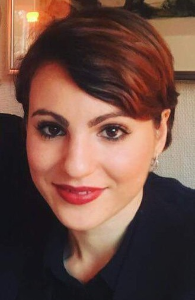

```{r setup, include=FALSE}
knitr::opts_chunk$set(echo = FALSE)
```
## People
```{r out.width = "25%"}
knitr::include_graphics("images/Chris.jpg")
```

**Dr. Chris Haffenden. Research co-ordinator (part-time).** My position involves helping researchers use the lab’s resources and the library’s digital collections. I assist in dealing with applications for research collaboration, in getting research projects up and running at the lab, and in fixing problems that arise as part of the research process. I also work with communicating and writing articles about the lab’s development projects, as well as running workshops and organizing outreach events to inform the academic community about our tools and resources. I’m always open to new initiatives for collaboration and outreach, so please get in touch!  

My academic background is in the field of intellectual and cultural history. I have an MPhil in Political Thought and Intellectual history from Cambridge University, and a PhD in the History of Science and Ideas from Uppsala University. My doctoral thesis, [Every Man His Own Monument](http://uu.diva-portal.org/smash/record.jsf?pid=diva2%3A1250312&dswid=4950) (2018), examined novel practices of self-monumentalizing in nineteenth-century Britain to present a new argument about the interconnection of celebrity culture and posthumous fame in this period. Apart from working at KBLab, I have also begun work on a new, [RJ-financed project](https://www.rj.se/en/grants/2020/self-erasure-and-practices-of-motivated-forgetting-in-nineteenth-century-britain/) that explores the emergence of self-erasure and the longer history of the right to be forgotten. My involvement with KBLab and my research interests are underpinned by a reflexive concern with the ways in which cultural heritage is produced and made use of. 

<br />
<br />

```{r out.width = "25%"}

```

**Elena Fano, Data scientist.** I joined KBLab in September 2020 and I have been working with different projects in the field of NLP. One of my main tasks as a data scientist at the National Library is to make the digital collections available to researchers for quantitative study. I also work with language models - for example I trained a Swedish spaCy model. My other projects include producing annotated datasets in Swedish, building topic models on historical collections and holding reading groups to discuss recent developments in NLP technologies. Sometimes I also do demos and presentations to showcase KBLab's work.  

My background before Natural Language Processing is in linguistics and cognitive science. I studied for many years how the human brain interacts with language, especially in bilingual subjects. Then I became interested in how a different type of computational entities, namely machines, can work with human language. I took a Master's degree in Language Technology from Uppsala University in 2019 and I started working as a data scientist with NLP expertise. I particularly enjoy experimenting with machine learning techniques and my programming language of choice is python.

