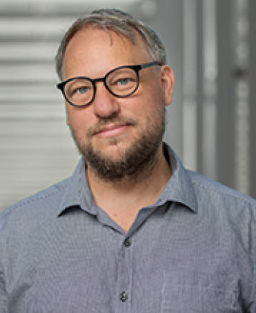
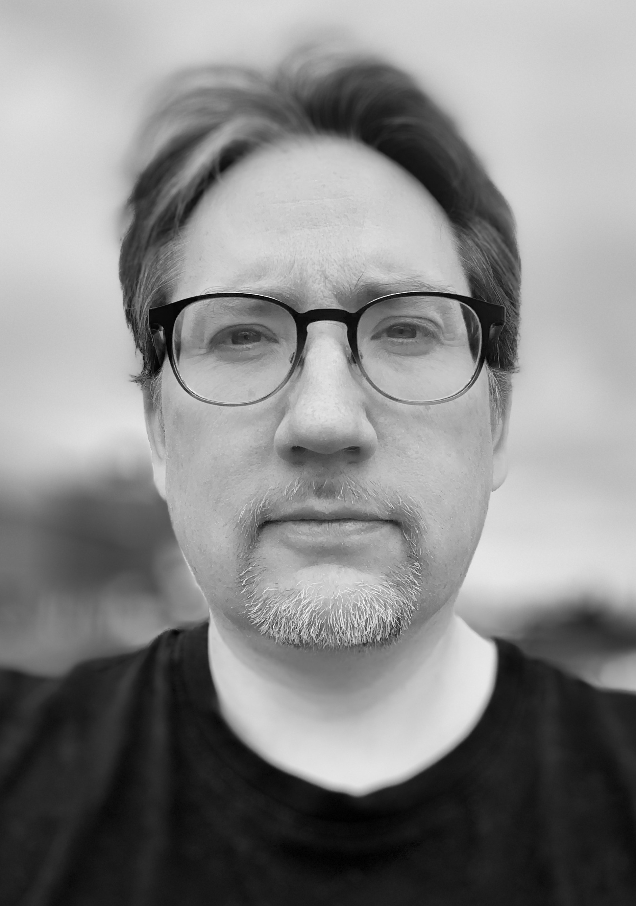
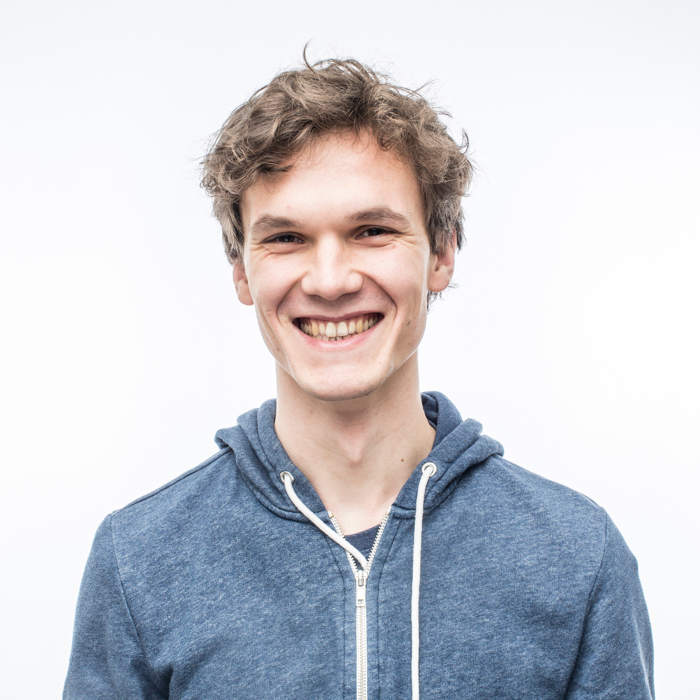
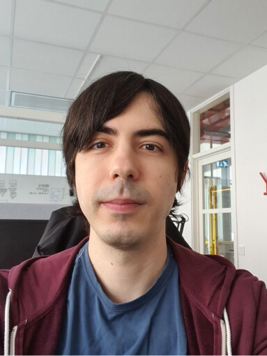
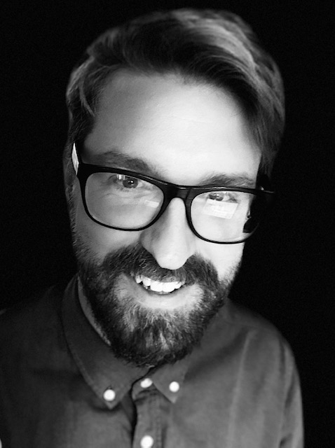
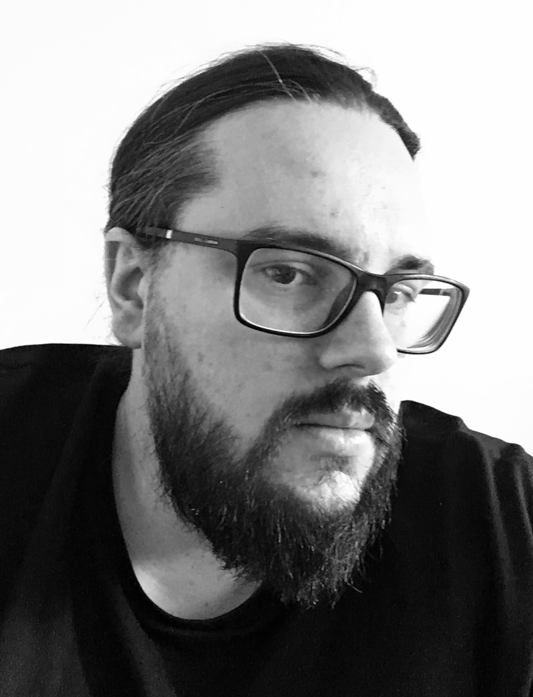
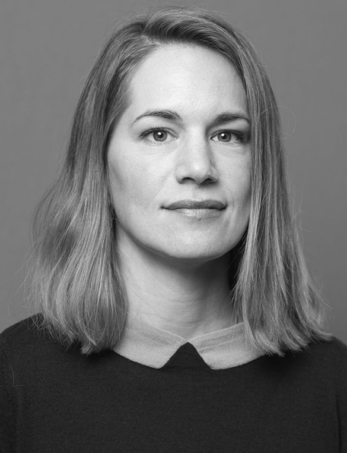

```{r setup, include=FALSE}
knitr::opts_chunk$set(echo = FALSE)
```
## People

```{r out.width = "25%"}

```
### Love Börjeson, Director [`r emo::ji("e-mail")`](mailto:love.borjeson@kb.se)
I work as a director for KBLab. I'm also an adviser to AI Sweden for applied AI, specifically Data and Infrastructure Lead and Applied Language Technology. To a large extent, my job involves collocating data, competence, and computational resources.   

I have a PhD in Industrial Organization and Economics and I have been a Postdoctoral Fellow and Research Fellow in Computational Social Science at Stanford University (School of Ed.). Academically/intellectually I would perhaps prefer to label myself as "some kind of sociologist".

<br />
<br />

```{r out.width = "25%"}

```
### Martin Malmsten, Data scientist and IT architect [`r emo::ji("e-mail")`](mailto:martin.malmsten@kb.se)
I work as a Data scientist at the lab and as an IT architect for the National Library. In these two roles I mainly focus on corpus creation, large transformer models, infrastructure design and prototyping. Having one foot in tech and data science and one in the library allows me to work strategically with larger questions such as where machine learning can be used to provide new insights into digital collections.  

My background is in computer science and software development. Having implemented and worked closely with numerous metadata standards and systems I am a strong supporter of Linked (Open) Data as a paradigm and a way to connect information. My main driver is getting as much information and tools into the hands of as many people as possible.

<br />
<br />

```{r out.width = "25%"}

```
### Robin Kurtz, Data scientist [`r emo::ji("e-mail")`](mailto:robin.kurtz@kb.se)
As one of the KBLab's data scientists I work on developing models and datasets
that are intended to be used not only internally at the National Library, but
also for general use by industry, governmental agencies, and academia.
With the recent rise of importance of transformer-based language models, we
focus on making use of the library's vast amounts of text data to train and
publish these language models.

I have a strong background in language technology, with degrees in natural
language processing (NLP), computational linguistics and computer science.
Before starting at the library in October 2020 I received my
[doctoral degree](http://urn.kb.se/resolve?urn=urn:nbn:se:liu:diva-167847)
in computer science (datalogi) from Linköping University, working on semantic
dependency parsing, studying algorithms, machine learning methods, and
potential applications.

<br />
<br />

```{r out.width = "25%"}
knitr::include_graphics("images/elena.jpeg")
```
### Elena Fano, Data scientist [`r emo::ji("e-mail")`](mailto:elena.fano@kb.se)
I joined KBLab in September 2020 and I have been working with different projects in the field of NLP. One of my main tasks as a data scientist at the National Library is to make the digital collections available to researchers for quantitative study. I also work with language models - for example I trained a Swedish spaCy model. My other projects include producing annotated datasets in Swedish, building topic models on historical collections and holding reading groups to discuss recent developments in NLP technologies. Sometimes I also do demos and presentations to showcase KBLab's work.  

My background before Natural Language Processing is in linguistics and cognitive science. I studied for many years how the human brain interacts with language, especially in bilingual subjects. Then I became interested in how a different type of computational entities, namely machines, can work with human language. I took a Master's degree in Language Technology from Uppsala University in 2019 and I started working as a data scientist with NLP expertise. I particularly enjoy learning about new machine learning techniques and my programming language of choice is Python.


<br />
<br />

```{r out.width = "25%"}

```
### Faton Rekathati, Data scientist [`r emo::ji("e-mail")`](mailto:faton.rekathati@kb.se)
My first contact with KBLab was as an external researcher. In the spring of 2020 I wrote a masters thesis on the subject of [curating news sections in historical newspapers](http://urn.kb.se/resolve?urn=urn:nbn:se:liu:diva-166313). Over the summer I continued work on the same project as a research assistant for Linköping University, before eventually ending up as a Data scientist with KBLab in September 2020. At KBLab I mostly work with making the library's collections of visual materials searchable and navigable. This includes image similarity search, free text search for images, along with adding metadata and tags to the materials by automatically detecting objects such as landmarks. 

My background is in statistics and machine Learning. At the lab I have come to specialize mainly on computer vision tasks. Lately, we have increasingly been experimenting with multimodal approaches in for example [classifying advertisements in newspapers](https://kb-labb.github.io/posts/2021-03-28-ad-classification/), and in implementing text search for images (using CLIP). As a statistician I of course love R `r emo::ji("smile")`, though nowadays I spend most of my time working with Python.

<br />
<br />

```{r out.width = "25%"}

```
### Chris Haffenden, Research co-ordinator (part-time)  [`r emo::ji("e-mail")`](mailto:chris.haffenden@kb.se)
My position involves helping researchers use the lab’s resources and the library’s digital collections. I assist in dealing with applications for research collaboration, in getting research projects up and running at the lab, and in fixing problems that arise as part of the research process. I also work with communicating and writing articles about the lab’s development projects, as well as running workshops and organizing outreach events to inform the academic community about our tools and resources. I’m always open to new initiatives for collaboration and outreach, so please get in touch!  

My academic background is in the field of intellectual and cultural history. I have an MPhil in Political Thought and Intellectual history from Cambridge University, and a PhD in the History of Science and Ideas from Uppsala University. My doctoral thesis, [Every Man His Own Monument](http://uu.diva-portal.org/smash/record.jsf?pid=diva2%3A1250312&dswid=4950) (2018), examined novel practices of self-monumentalizing in nineteenth-century Britain to present a new argument about the interconnection of celebrity culture and posthumous fame in this period. Apart from working at KBLab, I have also begun work on a new, [RJ-financed project](https://www.rj.se/en/grants/2020/self-erasure-and-practices-of-motivated-forgetting-in-nineteenth-century-britain/) that explores the emergence of self-erasure and the longer history of the right to be forgotten. My involvement with KBLab and my research interests are underpinned by a reflexive concern with the ways in which cultural heritage is produced and made use of. 

<br />
<br />

```{r out.width = "25%"}

```
### Fredrik Klingwall, Developer/Data curator (part-time) [`r emo::ji("e-mail")`](mailto:fredrik.klingwall@kb.se)
I am a developer at the National Library nearing two decades of working with the national Libris systems. Joined the KBLab team part-time in 2019 and would describe myself as a Semantic information modeler thinking about "connectedness" and usefulness of data. RDF is the language of expression and my current role at KBLab is being a helping hand in this field and integration of our metadata infrastructure. Special interest as some may already have surmised is linking entities and identity disambiguation.  

My background is sprawling but started somewhere long ago in Computer Science classes at Stockholm University/DSV. Gravitated to musicology and sound engineering for a while but back hands on in the information/knowledge sphere again.

<br />
<br />

```{r out.width = "25%"}

```
### Emma Rende, Product manager (part-time) [`r emo::ji("e-mail")`](mailto:emma.rende@kb.se)
My contribution to the lab is within overall strategy and usability. In my work I try to understand who our users are, what their needs are, and how to reach them in the best possible way.
I have driven the process of mapping the lab user journey, which changes continuously as the lab develops. I´ve also had a leading part in identifying the core values for the lab. I only work part-time in the lab, but as a product manager I naturally take the lab's questions into the various forums I participate in at KB.  
 
I have previously worked within the private sector as a business analyst and business developer in e-commerce. Throughout my career, I have always had a focus on the user experience, but with a commercial insight. I have a master's degree in Computer and Systems Science from Stockholm University. 