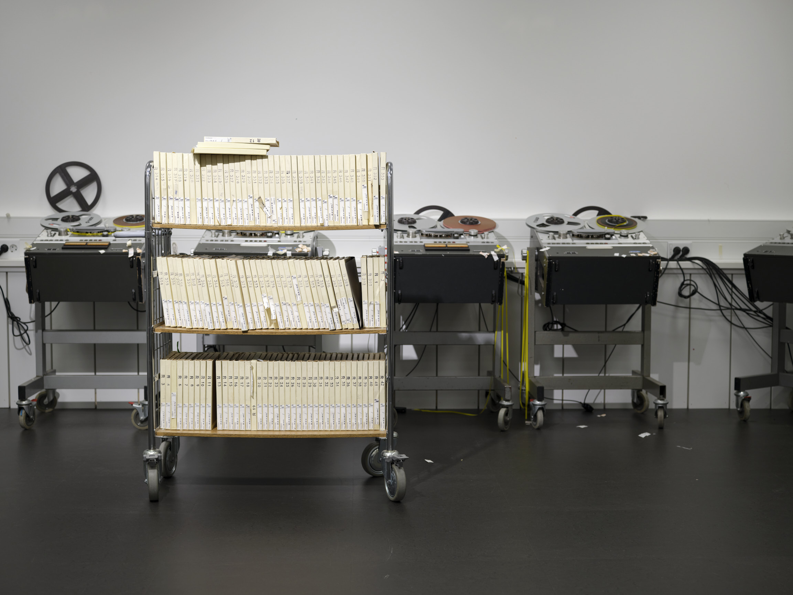
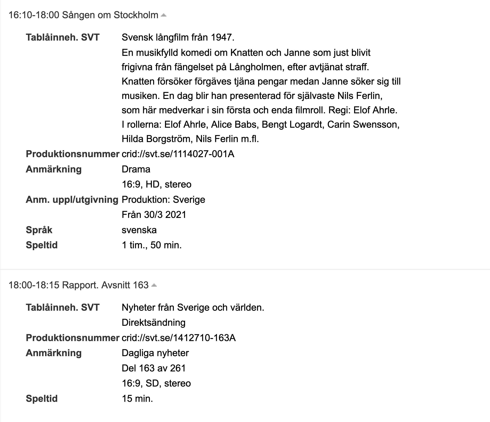
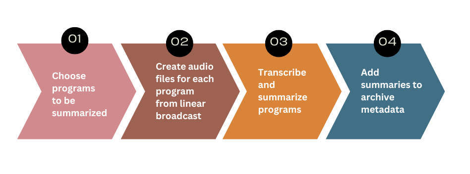
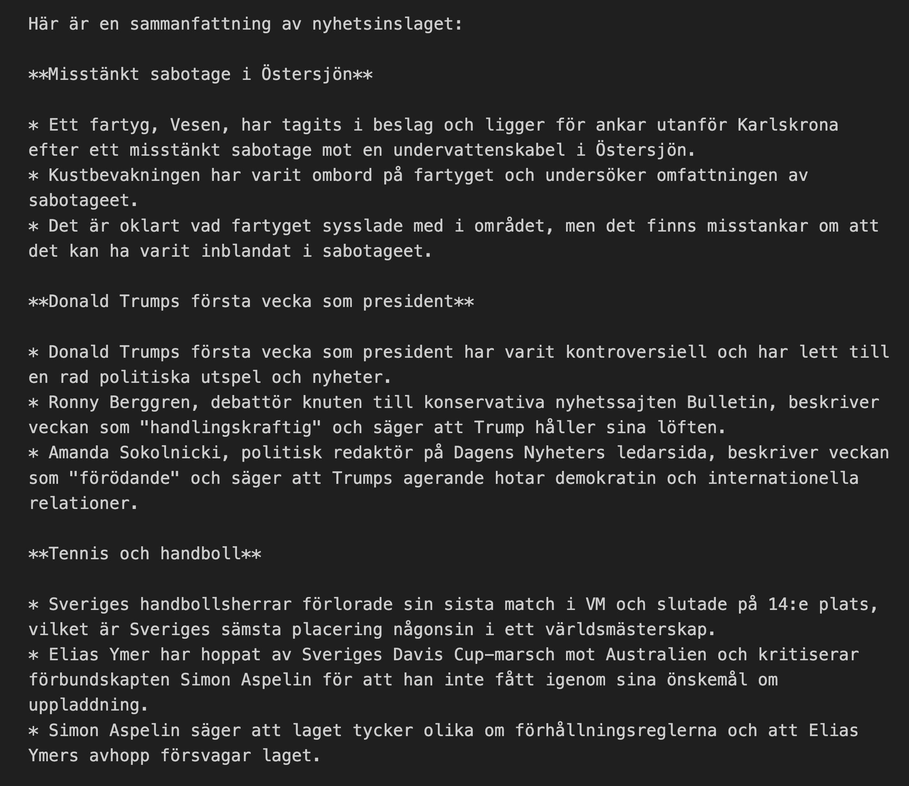
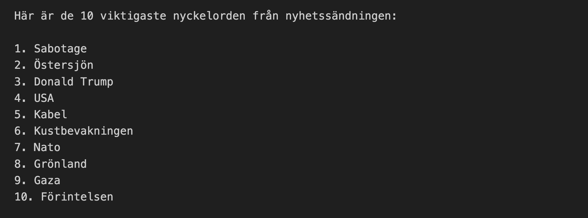

{width="300%"}

# The context
Everything that is broadcast on Swedish radio and television is archived at KB in the national database for audio-visual materials, SMDB (Svensk MedieDataBas). The TV and radio-archives are cataloged using metadata purchased from a Swedish news agency, TT, including program schedules, air times, and subject matter. However, for many programs - particularly live news broadcasts - this metadata is incomplete or too generic to be useful.
Compare these two content descriptions as an example:

Where the movie *Sången om Stockholm* has an informative description of the plot, the news program *Rapport* is only described as "news".
In order to make the archive more usable for researchers, who may not only be interested in *that* news have been discussed but also *what* news have been discussed, the metadata has been manually supplemented with content information. Up until now, experienced cataloging staff have been spending up to one work-day per week, listening through selected news broadcasts and typing up summaries of the highlighted stories.
This seemed to us a perfect project for KBx, a collaborative initiative between KB-labb, development, and production, with the aim of catalyzing AI usage internally at the library. A time consuming, repetitive, language-based task that steals time from other tasks that require the staff’s expertise is a great candidate for automation.

# The goal
Ideally we would want to accommodate visitors and researchers by making all of the AV-content searchable, something we are working on in our project *Mediesök*. However, due to legacy systems and limited capacity, we do not currently have the ability to transcribe every broadcast, nor to store every transcription. So an intermediate solution is required!
In our case it means limiting the amount of processing to only the news programs that are currently being manually enriched, which severely lack in metadata and are likely to be relevant to research; and limiting the amount of information stored to a summary instead of the whole transcript. Resulting in the following automated workflow:

Selected TV and radio programs are transcribed using KB-Whisper [@vesterbacka2025swedishwhispersleveragingmassive], a transcription model we released in February 2025. The transcribed text is then summarized using a language model (currently Llama 3.1-8B-Instruct [@grattafiori2024llama]). These summaries are automatically added to the institution’s national AV catalogue, SMDB, in a dedicated field clearly labeled as AI-generated. Catalogue staff manage only the selection of programs to be processed - everything else happens without manual input.

<aside>
Check out our post about finetuning our own Whisper model [here](/posts/2025-03-07-welcome-KB-Whisper/index.qmd)
</aside>

# The process
## Identifying needs
We started the whole project by talking to the AV-catalogers who were creating the manual summaries. What was their current process? How much time did they spend? Why did they think this was important to do, and what would they like the finished automated process to look like? We realized that the current process was cobbled together from numerous sources.
It included: scripts that scraped open access summaries from broadcasters' websites that regularly change their layout leading to regular adapting of the scripts; rewriting official broadcaster summaries that are copyrighted; listening to the initial recap of a news broadcast and writing a summary; and, for programs where only a few news stories are mentioned in the initial recap, listening to entire programs and writing up a summary.
So, we wanted an automated process that worked for all of the relevant programs, regardless of source, and required little to no oversight.

## Experimenting with models
Not having trained a generative LLM ourselves yet, we set out to test some available open source models that we could run in-house. The model needed to:

1. understand and output the Swedish language
2. produce summaries that accurately portray the original text
3. format the output relatively consistently
4. have a context length that could handle transcriptions of up to 1h programs.

Size and language-wise, our two frontrunners were Gemma2-9B [@team2024gemma] and Llama3.1-instruct-8B [@grattafiori2024llama]. But we finally settled on the Llama because, compared to Gemmas context length of 8 192 tokens that could process around 10 minutes of audio transcriptions, Llama could process up to 1.5 hours with its 128 000 token context window.

## Prompt workshop
With an LLM selected, the next step was to work on a prompt. To figure out what we wanted the summaries to look like, and what kind of prompt would get us there, we gathered the AV-catalogers for a workshop.
Running a Jupyter-notebook on one of the lab's computers, equipped with GPUs for fast processing, we spent an afternoon getting a feel for how the model responded to different kinds of instructions.

::: {layout-ncol="2"}

{.lightbox}

{.lightbox}

:::

An important lesson from the prompt-workshop was managing expectations. Not even the most well thought out prompt will produce completely consistent output. This is partly because of the stochastic nature of large language models in general, but we were also limited in the size of the model we were able to run and smaller models are *generally* more inconsistent. The quality of our outputs varied quite a lot from case to case; sometimes the formatting was exactly what we specified, sometimes liberties were taken. Thus, discussions about expectation, what kind of output was “good enough”, was a large piece of this part of the process.
Depending on the use case, the minimum level of quality of a summary may be different. In the context of this initiative, we are focusing primarily on enhancing the searcheability of the AV-archives. As long as the summaries mention a majority of the subject matters in the broadcast, it will help end users navigate the archive and find the original source. We may therefore be more lenient towards small errors than for example a case where users cannot access the original source.

## Looping in production
Another vital collaboration through out the initiative was with the IT-department and the dev-team.
Together with our metadata expert, we figured out what metadata was possible to store in the catalog and how, where we could run language models to continuously process new broadcasts, how the catalogers could manage which programs that should be processed.
It was decided that the models should be run in a Kubernetes environment, meaning a Kubernetes crash course for developers and data scientists alike who had not worked with it before. An admin interface for the catalogers was developed within LevReg, the library's system for handling delivery of digital deposits.

Through the admin interface, the staff can select which programs to summarize, either by specific broadcasting times, or by the program name. The relevant audio is then retrieved from the digital archive and transcribed with kb-whisper and a summary of the transcription is produced by the Llama model using our prompt. The summary is then made available in the admin interface where the staff can check the quality before copy-pasting it into the AV-catalog along with a caveat that the added content is AI-generated.

## Testing and improvements
The first iteration is seldom the last! Once the admin interface was up and running, the catalogers were able to try out the process and gather feedback and ideas for improvement.

One thing that became clear was that different news programs needed different kinds of instructions (depending on run time, chatty shows vs formal reporting etc). This has already been amended, and the admin interface has been updated such that the catalogers are able to customize prompts for each program.

Another improvement in progress is upgrading the summarizing LLM. When developing the first iteration, we were limited to running the models on CPU’s which meant smaller models. Now, however, we are able to make use of GPU’s allowing us to perform the summarization with a larger model such as Gemma 3 27b [@gemmateam2025gemma3technicalreport]. We anticipate that this will improve the quality of the outputted summaries and make them more consistent.

The next step planned is for the summaries to be automatically added to the catalog, without the need for copy-pasting by staff. This will be implemented once we have seen improvements from the multiple prompts and new model, and we feel confident that the summaries achieve our approved level of quality.

# Reflections
While this initiative involved everyone learning a lot about the technical aspects (such as prompt engineering and working with kubernetes), it taught us just as much about the process of implementing new methods in an existing system.

**New ways of working mean organizational change:** When developing a new workflow, the changes need to be led by department heads as well as the dev team to make sure that it is clear what the new tasks are for the staff. For our purposes that chiefly meant delineating responsibility for the generated summaries. Who is responsible when the summary isn’t perfect? Should staff edit mistakes? Clear guidelines are helpful when automating a task that a person used to be accountable for.

**People want to be involved:** Throughout this initiative, we met a lot of interest from colleagues. There was curiosity about new technology, concern about accuracy and integrity, important input about implementation, among others. While it can be time consuming to manage differing expectations, especially for a small team with limited resources, it is essential to find a balance between making progress and keeping the organization in the loop.

**Finding the balance between short-term and long-term:** Working with inflexible legacy systems, it is easy to get stuck either looking at small-scale fixes of single elements within an existing workflow, or waiting for the exact right circumstances for making large-scale overhauls of entire processes. These approaches, however, are needed in tandem. Starting with small-scale initiatives helps you figure out what could be possible down the line, as well as preparing the organization for handling new technologies or processes whenever it is time for a large-scale change.

Small-scale initiatives like this not only improve current workflows, but also help cultural heritage institutions prepare for a future where AI becomes an integrated part of archival infrastructure. Structures like KBx play an important role by creating new meeting points between AI specialists and domain experts.