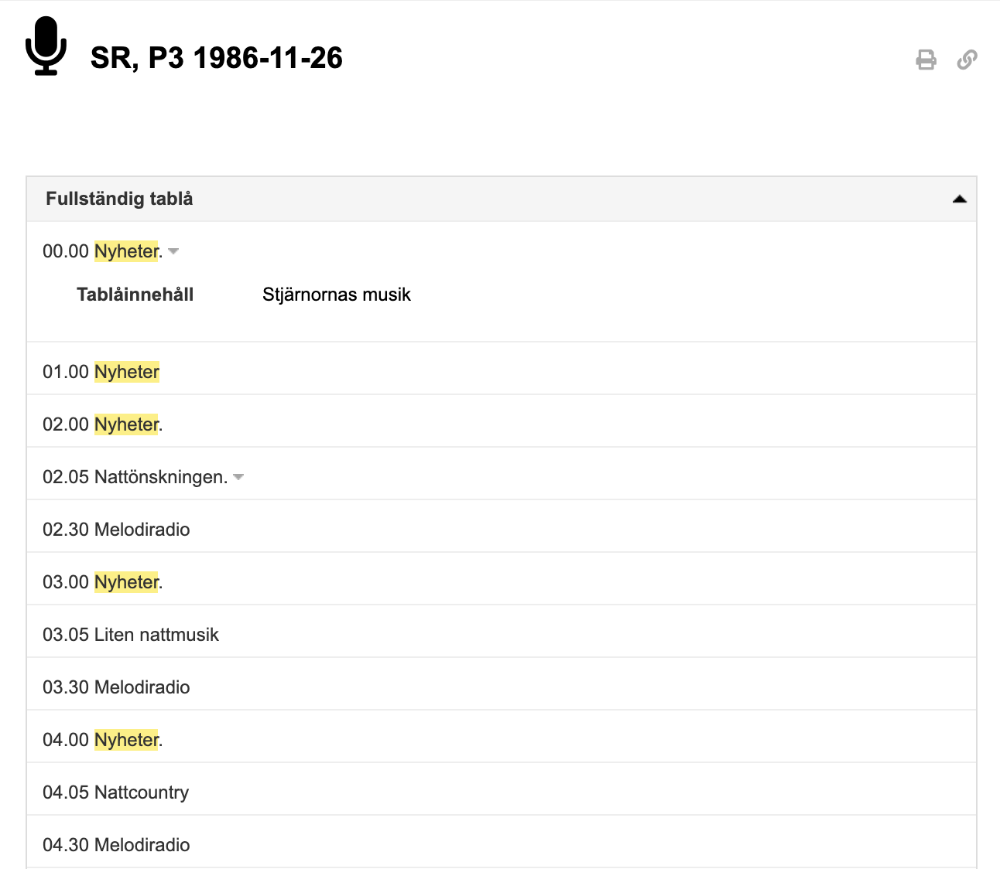
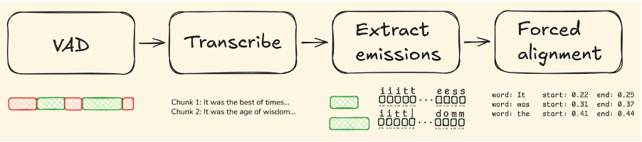
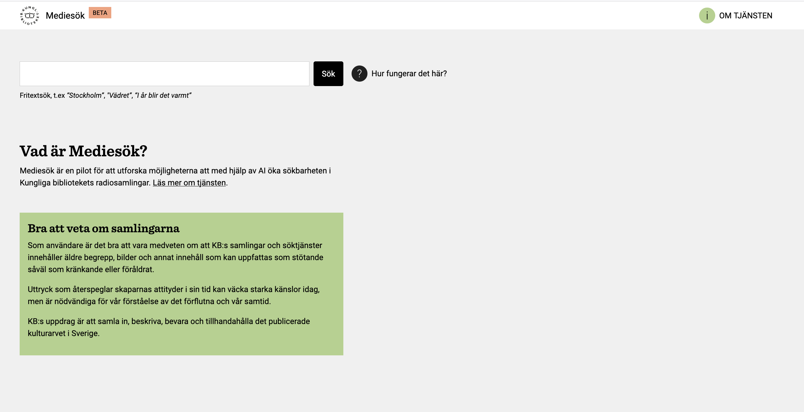
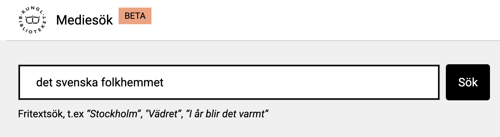
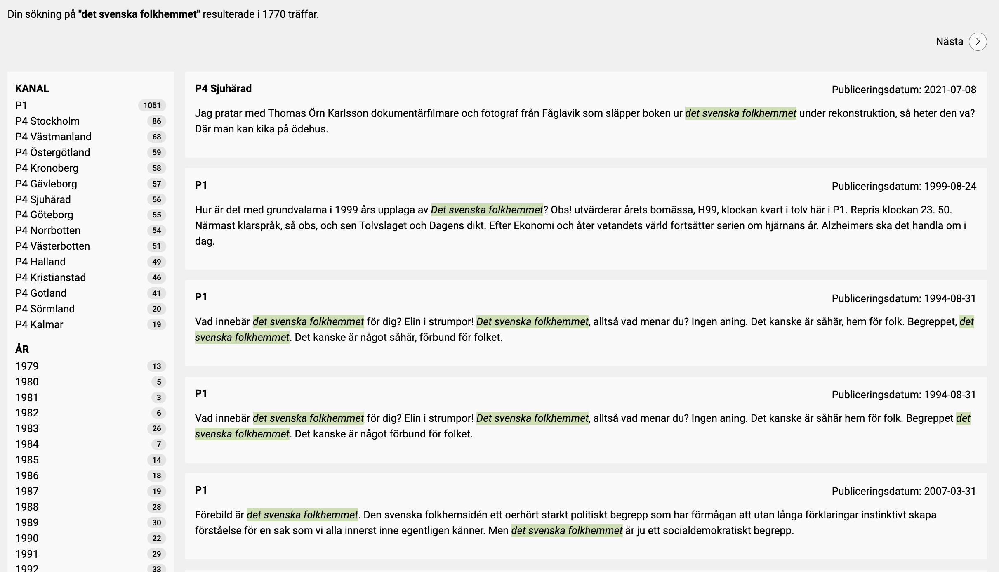
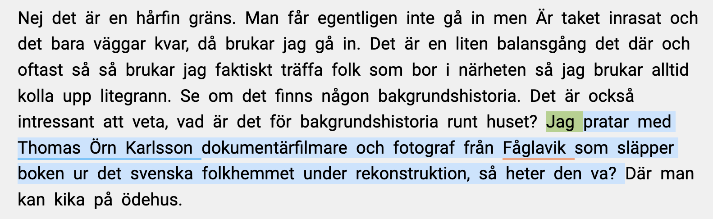
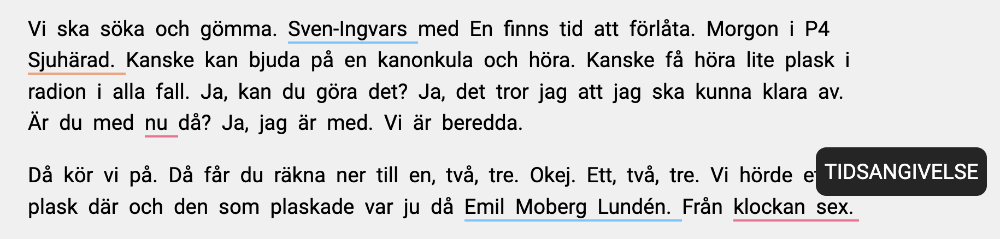

# Navigating the unnavigable

KB holds a vast collection of audio-visual (AV) material, including more than ten million hours of film, television and radio. Since the introduction of legal deposit legislation for AV material in 1979, the library’s holdings have continued to grow across these media. The Swedish Media Database ([SMDB](https://smdb.kb.se/)) now contains more than 2.3 million records, ranging from recent news broadcasts to nineteenth-century phonograph cylinder recordings. For researchers interested in Swedish history and culture, this material offers rich potential for tracing changes in language use and public discourse, as well as shifts in everyday life and media practices.

Yet despite this potential, the AV archive has proved challenging to search and explore. Researchers can often locate individual items by title, such as a specific film or album. But this is rarely possible for recurring broadcast content such as local news or radio programmes. In many such cases, the catalogue contains little more than the date and time of transmission, while offering very limited information about the actual content of the broadcast (see @fig-1).

Anyone trying to locate something more specific would therefore need to know in advance exactly when a programme was aired – or else listen through large amounts of material in real time in the hope of finding it. In library terms, it is hard to think of a closer equivalent to looking for a needle in a haystack. Without richer descriptive metadata, much of the AV archive – and especially the radio material – has remained difficult to navigate and even harder to use for research at scale.

{#fig-1 .lightbox }

# From audio to searchable text

Recent advances in AI have opened up novel approaches to AV archives. What would once have required an enormous amount of manual labour – transcribing spoken broadcasts into searchable text – can now be done automatically. For radio collections in particular, this creates new possibilities for searching audio collections beyond the limits of traditional catalogue metadata.

But producing useful transcripts is not simply a matter of running audio files through a single speech-to-text model. To ensure the best possible quality and make spoken broadcasts searchable in practice, several steps need to work together. The audio first needs to be segmented so that speech can be distinguished from silence, music and other sounds. The segments containing speech then need to be transcribed, and the resulting text aligned back to the recording with enough precision to identify where particular words and passages occur.

This kind of pipeline is what makes it possible to create transcripts that are not only readable, but also searchable and navigable, as discussed in our recent post on [easytranscriber](https://kb-labb.github.io/posts/2026-02-26-easytranscriber/). For Swedish radio material, this also places particular demands on the underlying speech-recognition models, which need to handle variation in dialect, sound quality and broadcast conditions. In short, it means relying on a high-quality model adapted to Swedish, such as [KB-Whisper](https://kb-labb.github.io/posts/2025-03-07-welcome-KB-Whisper/). 

{#fig-2 .lightbox}

# Designing a new entry point to the radio archives

To explore the new forms of access opened up by large-scale automated transcription, we developed *Mediesök*, a search tool for KB’s radio archives. As a pilot project, this aimed both to encourage collaboration between KBLab’s data scientists, collections experts and the library’s developers, and to improve the searchability of the collections.

The result is an interface that makes the radio archives searchable through free-text queries (see @fig-3). Rather than relying solely on broadcast metadata, users can search the transcribed contents of radio programmes and move directly to the relevant point in a recording. In this way, material that has long been difficult to navigate becomes more searchable and easier to use for research. 

Content-based search allows us to engage in precisely the kind of granular inquiry we have come to expect when finding information online. What once felt like a haystack can now be searched with far greater precision.

{#fig-3 .lightbox }

The search tool currently includes broadcasts from P1, as well as local radio from P4, and is intended to expand as more of the radio archives are transcribed. Because the material has been automatically transcribed and aligned with the audio, users can not only identify relevant broadcasts but also follow the transcript as the recording plays and jump directly to a specific passage from a search result. As a prototype, *Mediesök*sök suggests a new way into the radio archives – one that makes large audio collections far easier to search and use as research material. It shows what becomes possible when sound can be searched like text.

# Searching for “det svenska folkhemmet”

Let us take a concrete example to show how the demo works. Say that we are interested in the idea of the Swedish welfare state and how the term “det svenska folkhemmet” has been used in different public contexts. We enter this into the free-text search window (see @fig-4).

{#fig-4 .lightbox}

Within seconds, the results are ready to browse. Previously, this kind of search would not have been possible; now the query immediately returns 1,770 results. These can also be filtered by radio channel and year, allowing us to narrow the material to a more specific time or place (see @fig-5).

{#fig-5 .lightbox }

Rather than pointing us only to a programme title or broadcast date, the tool returns specific occurrences of the phrase within the transcript. This allows us to move directly to the relevant passage. If we click on the first result from P4 Sjuhärad, we are taken straight to the point where the term appears and can listen to the audio via the built-in media player.

The presence of accurate time stamps also allows the highlighter to follow the transcript word by word in real time (see @fig-6). This makes it possible to listen to the programme in context and navigate easily within it. We can also click directly in the transcript to start playback from a chosen point.

{#fig-6 .lightbox }

The transcript is also enriched with named entities. People, places, organisations and temporal expressions are marked with coloured underlining in the interface — blue for people, orange for places, green for organisations and red for time expressions (see @fig-7). This adds another layer of structure to the material, making it easier to spot relevant references while browsing.

{#fig-7 .lightbox  width=100% }

As this example suggests, Mediesök makes it possible to search the spoken contents of broadcasts rather than relying only on programme metadata. In doing so, it opens up words and phrases that would otherwise be difficult to find. The search tool shows how AI can provide both greater precision and a more efficient way of navigating the radio archive.

# A demo still in development

Mediesök is still a beta service, and there are some practical limitations to bear in mind. For legal reasons relating to copyright and data protection, access is currently restricted to researchers working on site at KB who have an SMDB account. The service is also still under development, and its coverage will continue to expand as more material is transcribed and incorporated. 

The aim is for all of KB’s digitized radio material to be included over time, with the scope eventually broadening to television and film as well. Even in its current form, Mediesök already includes a substantial body of transcribed material: more than 11.6 billion words across P1 and multiple local radio channels (see @tbl-corpus).

The transcripts themselves are generated automatically and are therefore not error-free. As with optical character recognition (OCR), speech-to-text can produce mistakes, especially in recordings with poor sound quality, overlapping voices, music or background noise. In some cases, the system may also generate nonsensical words or phrases – so-called hallucinations. Mediesök should therefore be understood not as a perfect representation of the broadcast, but as a new and powerful research aid for searching, locating and navigating audio material.

Table: Current size of the transcribed radio corpus underlying Mediesök, measured in total words across P1 and local radio channels
 {#tbl-corpus .striped .hover .sm .bordered }

| Channel | Total Words |
|:--------|------------:|
| p1      | 2,384,053,857 |
| p4sth   |   782,809,256 |
| p4ostg  |   744,968,818 |
| p4vstm  |   717,899,117 |
| p4kron  |   715,289,673 |
| p4nbtn  |   703,958,778 |
| p4krist |   694,009,155 |
| p4gavl  |   693,043,971 |
| p4gbg   |   689,532,531 |
| p4vbtn  |   680,941,504 |
| p4hall  |   679,863,155 |
| p4gotl  |   678,915,139 |
| p4sorm  |   661,308,514 |
| p4sju   |   646,568,789 |
| p4kalm  |   137,461,770 |
| **Total** | **11,610,624,027** |

# Toward a searchable archive

Mediesök emerged within a broader institutional context. The project was developed as part of KBx, a collaborative format designed to bring together KBLab, developers and domain experts around concrete challenges in the library’s infrastructure. The beta service is therefore not only a new research tool, but also a concrete example of what KBx can make possible: experimental collaborations that open up new ways into the collections. As such, it stands alongside other KBx initiatives that explore how AI can expand access to cultural heritage material, such as [Bildsök](https://kb-labb.github.io/posts/2023-10-20-unearthing-forgotten-images-with-the-help-of-ai/), our image search demo, and [automated summaries in the AV archives](https://kb-labb.github.io/posts/2026-03-17-tablakomplettering/).

Viewed in this light, Mediesök is part of a broader transformation in how audio-visual archives are used. If handwritten text recognition (HTR) has reshaped access to handwritten collections by making previously opaque material searchable at scale, automated speech transcription suggests a comparable shift for radio archives. In both cases, AI does not replace interpretation, but changes the conditions under which it can begin. What HTR has already begun to do for the handwritten archive, automated speech transcription may now do for radio. 

# Acknowledgements

Mediesök evolved from an initial demo into a beta service through close collaboration between KB’s developers, collections experts working with AV material, and data scientists from KBLab. Our thanks to everyone involved.

Part of this development work was carried out within the [HUMINFRA](https://www.huminfra.se/) infrastructure project.

:::{.column-margin}
{width="40%"}
::::
