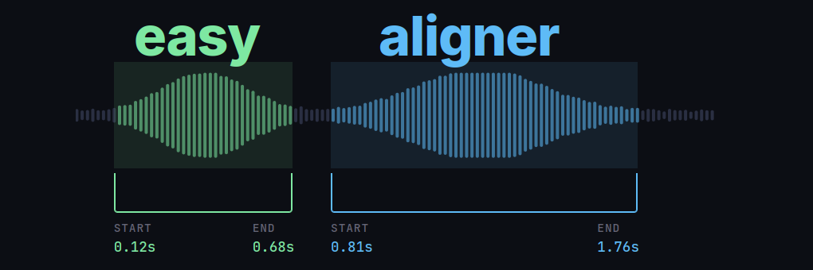
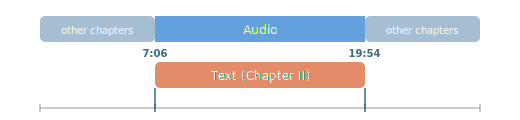
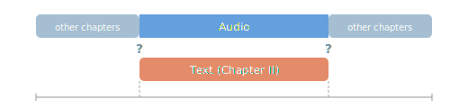

{width="100%"}

[`easyaligner`](https://kb-labb.github.io/easyaligner/) is a forced alignment library for aligning text transcripts with audio. It is designed with a focus on ease of use, flexibility, and performance. The library can be used for a variety of applications, including

* Aligning e-texts with audiobook recordings to create interactive reading experiences (see the [interactive demo](#interactive-demo) below).
* Aligning podcast transcripts to enable features like chapter navigation and keyword search.
* Aligning protocols and recordings of parliamentary debates for research and accessibility purposes. 
* Fixing misaligned subtitles in videos, or creating new subtitles from transcripts.
* Creating large-scale speech recognition and speech synthesis datasets for AI model training. 

The aligned outputs from [`easyaligner`](https://kb-labb.github.io/easyaligner/) can be segmented at any level of granularity (sentence, paragraph, etc.), while preserving the original text’s formatting. 

::: {.callout-tip}
See `easyaligner`'s documentation on [text processing](https://kb-labb.github.io/easyaligner/get-started/text_processing.html) for more details on how to customize tokenization and text normalization to suit your specific use case and language.
:::

## Tutorials

The `easyaligner` documentation provides tutorials for three common forced alignment scenarios. The guides cover scenarios where the ground-truth text spans either all or only part of the spoken content in the audio, and where the relevant audio region is either known in advance or needs to be discovered.

::: {.panel-tabset}

### Tutorial 1: Simple case
:::: {.callout-note title="Scenario"}
[Align text and audio](https://kb-labb.github.io/easyaligner/get-started/tutorial01.html): the text transcript covers all the spoken content in the audio.

{width="100%"}
::::

### Tutorial 2: Known audio region
:::: {.callout-note title="Scenario"}
[Known audio region](https://kb-labb.github.io/easyaligner/get-started/tutorial02.html): the text covers only part of the spoken content in the audio. But we know the relevant audio region in advance (e.g. from metadata or a table of contents).

{width="100%"}
::::

### Tutorial 3: Unknown audio region
:::: {.callout-note title="Scenario"}
[Locate relevant audio region](https://kb-labb.github.io/easyaligner/get-started/tutorial03.html): the text covers only part of the spoken content in the audio, and we don't know the relevant audio region in advance. Uses fuzzy text matching against an ASR transcription to discover the region.

{width="100%"}
::::

:::

## Pipeline

`easyaligner` runs three pipeline stages in sequence: voice activity detection (VAD), emission extraction, and forced alignment. These can, most conveniently, be run as a single `pipeline()` call. Each stage can however also be run independently.

For VAD, `easyaligner` supports both `pyannote` and `silero` models. Note that `pyannote` is a gated model. You need to accept the [terms and conditions](https://huggingface.co/pyannote/segmentation-3.0) and authenticate with a Hugging Face [access token](https://huggingface.co/docs/hub/en/security-tokens) to be able to run the model. `silero` can be used without authentication.

::: {.callout-note}
VAD outputs are currently not used for alignment purposes, but rather for ASR transcription purposes in the companion library [`easytranscriber`](https://kb-labb.github.io/easytranscriber/). 
:::

`easyaligner` scales well for longer audio recordings. It can be used to align hours of audio in a single pass---without the need to segment the audio into smaller chunks. This allows the forced alignment to operate globally over the full sequence, rather than segment by segment [@pratap2024scaling]. 

::: {.column-margin}
The GPU-accelerated forced alignment in `easyaligner` uses Pytorch's [forced alignment API](https://docs.pytorch.org/audio/stable/tutorials/ctc_forced_alignment_api_tutorial.html).
:::

## Installation

```bash
pip install easyaligner --extra-index-url https://download.pytorch.org/whl/cu128
```

When installing with [uv](https://docs.astral.sh/uv/), PyTorch's CUDA/CPU version is selected automatically:

```bash
uv pip install easyaligner
```

## Usage

The following example downloads and aligns a 57-second snippet from a LibriVox audiobook recording of [A Tale of Two Cities](https://librivox.org/a-tale-of-two-cities-by-charles-dickens-2/), corresponding to the first paragraph of Chapter I. The text to be aligned is supplied directly as a string:

```python
from pathlib import Path

from transformers import (
    AutoModelForCTC,
    Wav2Vec2Processor,
)
from huggingface_hub import snapshot_download

from easyaligner.text import load_tokenizer
from easyaligner.data.datamodel import SpeechSegment
from easyaligner.pipelines import pipeline
from easyaligner.text import text_normalizer
from easyaligner.vad.pyannote import load_vad_model

file_pattern = "tale-of-two-cities_align-en/taleoftwocities_01_dickens_64kb_align.mp3"

# Download mp3 from HF dataset repo
snapshot_download(
    "Lauler/easytranscriber_tutorials",
    repo_type="dataset",
    local_dir="data/tutorials",
    allow_patterns=file_pattern,
)

text = """
It was the best of times, it was the worst of times, it was the age of
wisdom, it was the age of foolishness, it was the epoch of belief, it
was the epoch of incredulity, it was the season of Light, it was the
season of Darkness, it was the spring of hope, it was the winter of
despair, we had everything before us, we had nothing before us, we were
all going direct to Heaven, we were all going direct the other way--in
short, the period was so far like the present period, that some of its
noisiest authorities insisted on its being received, for good or for
evil, in the superlative degree of comparison only.
"""

text = text.strip()

# The alignments will be organized according to how the text is tokenized
tokenizer = load_tokenizer(language="english") # sentence tokenizer
span_list = list(tokenizer.span_tokenize(text)) # start, end character indices
speeches = [[SpeechSegment(speech_id=0, text=text, text_spans=span_list, start=None, end=None)]]

# Load models and run pipeline
model_vad = load_vad_model()
model = (
    AutoModelForCTC.from_pretrained("facebook/wav2vec2-base-960h").to("cuda").half()
)
processor = Wav2Vec2Processor.from_pretrained("facebook/wav2vec2-base-960h")

# File(s) to align
filepath = Path("data/tutorials") / filepath_pattern
audio_dir = filepath.parent
audio_files = [filepath.name]

pipeline(
    vad_model=model_vad,
    emissions_model=model,
    processor=processor,
    audio_paths=audio_files,
    audio_dir=audio_dir,
    speeches=speeches,
    alignment_strategy="speech",
    text_normalizer_fn=text_normalizer,
    tokenizer=tokenizer,
    start_wildcard=True,
    end_wildcard=True,
    blank_id=processor.tokenizer.pad_token_id,
    word_boundary="|",
)
```

::: {.column-margin}
::: {.callout-tip}
`easyaligner` allows organizing the output at any level of granularity (sentence, paragraph, or custom). In this example, we use `nltk`'s `PunktTokenizer` for sentence-level segmentation. See the [text processing documentation](https://kb-labb.github.io/easyaligner/get-started/text_processing.html) for custom tokenizers.
:::
:::

::: {.column-margin}
::: {.callout-tip}
To use `silero` instead of `pyannote` for VAD, simply replace the import: `from easyaligner.vad.silero import load_vad_model`. The rest of the code stays the same.
:::
:::

::: {.callout-tip}
A list of suitable emission models for different languages can be found in the [WhisperX library](https://github.com/m-bain/whisperX/blob/d8a078eed46b139f90d7f33b472119e9be9ff969/whisperx/alignment.py#L41-L77).  

If your audio and transcript are multilingual, you can try using the Massively Multilingual Speech model from Meta: [mms-1b-all](https://huggingface.co/facebook/mms-1b-all).
:::


### Output

`easyaligner` outputs a JSON file for each pipeline stage. The final aligned output in `output/alignments` contains word-level timestamps:

```
output
├── vad          ← SpeechSegments with AudioChunks (VAD boundaries)
├── emissions    ← + emission file paths (.npy)
└── alignments   ← + AlignmentSegments with word timestamps
```

Each alignment segment includes segment-level and word-level start/end timestamps with confidence scores:

```json
{
  "start": 4.972,
  "end": 56.992,
  "text": "It was the best of times, it was the worst of times, ...",
  "score": 0.975,
  "words": [
    {"text": "It ",      "start": 4.972,  "end": 5.052,  "score": 0.631},
    {"text": "was ",     "start": 6.673,  "end": 6.773,  "score": 1.000},
    {"text": "the ",     "start": 6.853,  "end": 6.953,  "score": 0.920},
    {"text": "best ",    "start": 7.273,  "end": 7.594,  "score": 1.000},
    {"text": "of ",      "start": 7.734,  "end": 7.774,  "score": 1.000},
    {"text": "times, ",  "start": 7.894,  "end": 8.574,  "score": 0.969}
  ]
}
```

## Interactive demo

Word-level timestamps allow for building interactive applications where text is highlighted in sync with the audio. In the demo below, we use the alignment output from the first paragraph of A Tale of Two Cities.  

Pressing play will highlight each word as it is spoken. You can also click any word to jump to that point in the audio. Dragging the progress bar will also cause the relevant spoken word at that timestamp to be highlighted. 

<div id="audio-player" class="audio-card">
  <div class="audio-card-label">Sample audio</div>
  <div class="audio-card-title"><em>A Tale of Two Cities</em> — Chapter 1, Paragraph 1 (LibriVox)</div>
  <audio controls>
    <source src="https://huggingface.co/datasets/Lauler/easytranscriber_tutorials/resolve/main/tale-of-two-cities_align-en/taleoftwocities_01_dickens_64kb_align.mp3"
    type="audio/mpeg">
  </audio>
</div>

<div id="transcript-container" class="transcript-container transcript-card" data-highlight-sentence="false" data-src="images/taleoftwocities_01_dickens_64kb_align.json"></div>

```{=html}
<script>
const audioPlayer = document.querySelector("#audio-player audio");
const container = document.getElementById("transcript-container");
const highlightSentence = container.dataset.highlightSentence !== "false";

const wordMap = [];
const alignmentMap = [];
let prevWord = null;
let prevAlignment = null;

fetch(container.dataset.src)
  .then((r) => r.json())
  .then((data) => {
    data.speeches.forEach((speech) => {
      let para = document.createElement("p");
      para.className = "chunk";

      speech.alignments.forEach((alignment) => {
        const sentenceSpan = document.createElement("span");
        sentenceSpan.className = "alignment";

        // Click sentence to jump audio
        sentenceSpan.addEventListener("click", () => {
          audioPlayer.currentTime = alignment.start;
          audioPlayer.play();
        });

        alignment.words.forEach((word) => {
          const wordSpan = document.createElement("span");
          wordSpan.className = "word";
          wordSpan.textContent = word.text;
          wordSpan.dataset.start = word.start;
          wordSpan.dataset.end = word.end;
          sentenceSpan.appendChild(wordSpan);

          // Click word to jump audio
          wordSpan.addEventListener("click", (e) => {
            e.stopPropagation();
            audioPlayer.currentTime = word.start;
            audioPlayer.play();
          });

          wordMap.push({ el: wordSpan, start: word.start, end: word.end });
        });

        para.appendChild(sentenceSpan);
        alignmentMap.push({
          el: sentenceSpan,
          start: alignment.start,
          end: alignment.end,
        });

        // Double newline signals a paragraph break
        if (/\r?\n\r?\n/.test(alignment.text)) {
          container.appendChild(para);
          para = document.createElement("p");
          para.className = "chunk";
        }
      });

      // Append any remaining sentences
      if (para.childElementCount > 0) {
        container.appendChild(para);
      }
    });
  });

function updateHighlight() {
  const t = audioPlayer.currentTime;

  const curWord = wordMap.find((w) => t >= w.start && t < w.end);
  if (curWord && curWord.el !== prevWord) {
    if (prevWord) prevWord.classList.remove("highlight-word");
    curWord.el.classList.add("highlight-word");
    if (audioPlayer.paused) {
      curWord.el.scrollIntoView({ block: "nearest", behavior: "smooth" });
    }
    prevWord = curWord.el;
  }

  if (highlightSentence) {
    const curAlignment = alignmentMap.find((a) => t >= a.start && t < a.end);
    if (curAlignment && curAlignment.el !== prevAlignment) {
      if (prevAlignment) prevAlignment.classList.remove("highlight-sentence");
      curAlignment.el.classList.add("highlight-sentence");
      prevAlignment = curAlignment.el;
    }
  }
}

// Update on seek (dragging progress bar while paused)
audioPlayer.addEventListener("seeked", updateHighlight);

// Use requestAnimationFrame (~60fps) instead of timeupdate (~4fps)
// so short words (< 250ms) don't get skipped
function tick() {
  if (!audioPlayer.paused) {
    updateHighlight();
  }
  requestAnimationFrame(tick);
}
requestAnimationFrame(tick);
</script>
```

::: {.column-margin}
You can find the [recording](https://librivox.org/a-tale-of-two-cities-by-charles-dickens-2/) of the audiobook at LibriVox.
:::

## Search interface: easysearch

Want to create similar interactive search interfaces for browsing and querying your alignment outputs?

`easysearch` is a lightweight search interface for browsing and querying alignment outputs, built into the companion library [`easytranscriber`](https://kb-labb.github.io/easytranscriber/). It indexes the alignment JSON files into a SQLite database with full-text search and serves a web UI with synchronized audio playback and transcript highlighting.

```bash
pip install easytranscriber[search]
easysearch --alignments-dir output/alignments --audio-dir data/audio
```

This indexes all alignment JSON files and starts a web server at `http://127.0.0.1:8642`. On subsequent launches, only new or modified files are re-indexed.

The search uses SQLite FTS5 and supports queries like `"exact phrase"`, `prefix*`, `word1 OR word2`, `word1 NOT word2`, and `NEAR(word1 word2, 3)`. Clicking a search result navigates to the document at the matching timestamp and begins playback with synchronized highlighting.

## Documentation and source code

Visit `easyaligner`'s documentation website for detailed guides, API references and more:

- **Documentation**: [kb-labb.github.io/easyaligner](https://kb-labb.github.io/easyaligner/)
- **GitHub**: [github.com/kb-labb/easyaligner](https://github.com/kb-labb/easyaligner)
- **PyPI**: [pypi.org/project/easyaligner](https://pypi.org/project/easyaligner/)

`easyaligner` can be used standalone for forced alignment of ground-truth transcripts with audio. For automatic speech recognition with alignment, see the companion library [`easytranscriber`](https://kb-labb.github.io/easytranscriber/), which uses `easyaligner` as its alignment backend.

## Acknowledgements

The forced alignment in `easyaligner` is based on Pytorch's forced alignment API, which implements a GPU-accelerated version of the Viterbi algorithm [@pratap2024scaling].

Public domain LibriVox recordings are used as tutorial examples.

### References

::: {#refs}
:::