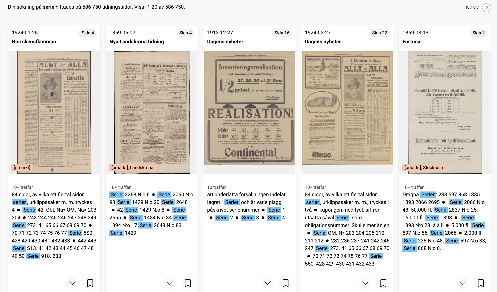
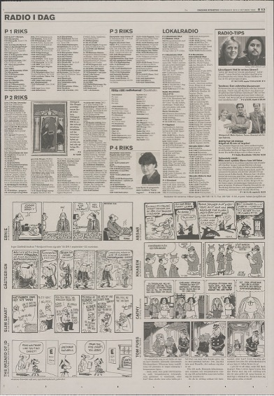
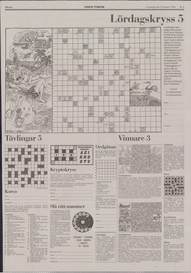
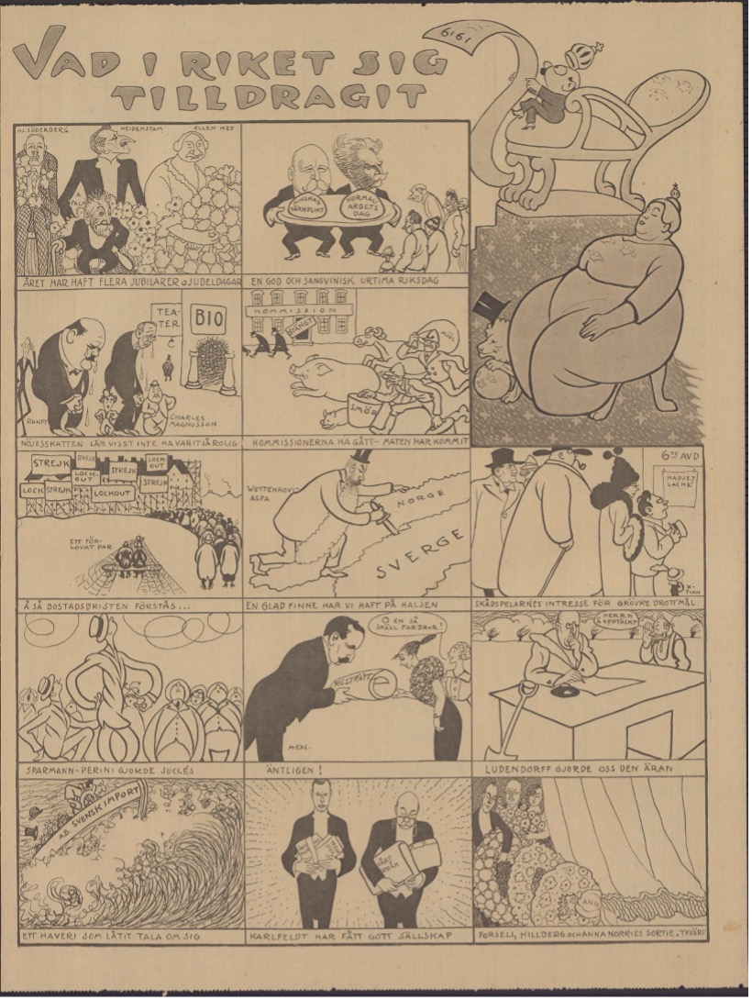
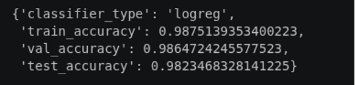

## Introduction 

Comics have been a recurring feature of Swedish newspapers for more than a century. Yet despite their cultural significance, they remain surprisingly difficult to study at scale. Researchers interested in the history of comics, visual storytelling, popular culture, or newspaper entertainment often face a fundamental problem: while newspapers have been extensively digitized, comics themselves are rarely described in the metadata of digital archives.

This challenge became the starting point for an exploratory internship project at KBLab. The work was developed in dialogue with the research project Against the Algos: How Comic Artists Manage Careers and Work in the Age of AI (2026–2029), led by Erik Nylander and Robert Aman at Linköping University. While that broader project investigates contemporary comic artists and their relationship to technological change, this pilot focused on a more foundational question: how might historical newspaper comics be made more discoverable in the first place?

The aim was modest but useful: to test whether computer vision could help identify likely comic pages in digitised newspapers and to produce a preliminary candidate list that future work could validate, improve and build upon. Such a resource could eventually support studies in Swedish comics history, computational media history, visual culture and the changing role of comics in public life.

The pilot produced a preliminary list of more than 85,000 candidate comic pages from four major Swedish newspapers, covering material from the early twentieth century to the present. These should be understood as candidate pages rather than a fully validated comics corpus.

## Why Comics Are Difficult to Find

At first glance, locating comics in digitized newspapers might appear straightforward. One might imagine searching for comic titles, character names, or keywords through OCR-generated text.

In practice, however, this approach quickly breaks down.

Several methods were explored during the early stages of the project, including:

  * OCR keyword searches
  * Title matching
  * Metadata-based retrieval
  *	Rule-based page classification

None of these approaches produced satisfactory results.

The underlying problem is that comics are fundamentally visual objects. Many comic strips contain relatively little text, and the text they do contain is often embedded in speech bubbles or stylized lettering. Historical newspapers introduce additional complications: scan quality varies considerably across decades, fonts change over time, and comic series may appear under different titles or formats.

{width="100%"}

As a result, many comics remain effectively invisible to traditional text-based retrieval methods.

Rather than treating comics as textual content, this project approached them as visual patterns. The question became: could a computer learn to recognize the visual characteristics of a comic page directly from images?

## Building a Training Dataset

### Choosing Dagens Nyheter

To train a comic classifier, an annotated dataset was first required.

Dagens Nyheter was selected as the primary source for training data for several reasons. Most importantly, the newspaper contains a long and relatively stable tradition of comics publication. During parts of its history, comics were even organized within a dedicated section known as DN Serier. This consistency made it an ideal starting point for identifying examples of comic pages across different historical periods.

### Sampling Across Time

One of the central challenges was ensuring that the classifier could recognize comics from newspapers published over more than a century.

To achieve this, three issues were randomly selected from each year between 1923 and 2025. This sampling strategy was intended to balance annotation effort with broad historical coverage, while still keeping the training phase manageable for an internship project.

By including material from many different decades, the dataset captured substantial variation in:

  *	Page layouts
  *	Printing techniques
  *	Graphic styles
  *	Newspaper design conventions

This temporal diversity proved crucial for developing a classifier capable of generalizing across historical periods.

### What Counts as a Comic?

Defining the positive class turned out to be more challenging than expected.

For the purposes of this project, a comic page was defined as a newspaper page containing comic strips or serialized comics. Single illustrations, decorative drawings, and standalone images were excluded.

::: {#fig-manus layout-ncol=2}

{#fig-2 .lightbox}

{#fig-3 .lightbox}

A newspaper page containing several comic strips (left), used as an example of the positive class. A visually similar illustrated page that was not classified as a comic page (right), since it lacks a clear sequential comic-strip structure.
:::

This distinction was not always straightforward. Full-page satirical illustrations, for example, often resemble comics visually while lacking sequential narrative structures. Determining where comics end and other forms of visual culture begin became one of the project's recurring methodological questions.

::: {#fig-manus layout-ncol=2}

{#fig-4 .lightbox}

{#fig-5 .lightbox}

Two borderline examples from the annotation process. Pages with large illustrations, puzzles, advertisements, or mixed visual material can resemble comics while still requiring interpretive judgement.
:::

The final annotated dataset consisted of:

| Category   | Number of Images |
|:-----------|-----------------:|
| Comics     | 447              |
| Non-comics | 5,962            |

Additional comic examples from other newspapers, including Svenska Dagbladet and Aftonbladet, were incorporated to increase visual diversity.

## Teaching a Computer to Recognize Comics

### Why DINOv2?

Several computer vision approaches were explored during the project, including CLIP- and ResNet-based solutions.

While these models perform well on many contemporary image recognition tasks, historical newspaper material presents a distinct challenge. Newspaper pages exhibit highly variable layouts, degraded print quality, changing visual styles, and inconsistent scanning conditions. Models optimized for object recognition or image-text alignment do not necessarily perform well in such environments.

The final workflow relied on DINOv2, a self-supervised vision model developed for robust visual representation learning.

DINOv2 offered several advantages:

  * It does not depend on OCR quality.
  * It captures broader visual structures rather than isolated image features.
  * It can be useful with limited labeled data.
  * It appeared promising for this kind of historical image material.

Most importantly, DINOv2 made it possible to represent the visual organisation of a page itself - an important feature when dealing with comics, where panel structures, speech bubbles and page layouts often matter more than textual content.

### Why Logistic Regression?
Rather than fine-tuning a large neural network, the project used DINOv2 as a feature extractor and trained a Logistic Regression classifier on top of the generated embeddings.

This approach offered several practical advantages.

First, the number of positive training examples was relatively small. Deep model fine-tuning would likely require substantially more annotated data.

Second, Digital Humanities projects often operate under limited computational resources. Training a lightweight classifier dramatically reduced computational costs while still achieving useful performance.

Third, Logistic Regression produces easily interpretable probability scores, making it possible to adjust confidence thresholds for different newspapers and use cases.

{width="70%"}

The workflow can be summarized as follows:

  * Newspaper page image
  * DINOv2 embedding
  * Logistic Regression classifier
  * Comic probability score

## From Classifier to Candidate List

After training and testing, the classifier was applied in an exploratory run over selected digitised newspaper collections.

The resulting candidate list currently contains:

| Newspaper           | Coverage  | Candidate Comic Pages |
|:--------------------|:----------|-----------------------:|
| Dagens Nyheter      | 1908–2024 | 24,692                 |
| Svenska Dagbladet   | 1907–2025 | 16,438                 |
| Expressen           | 1944–2025 | 32,694                 |
| Arbetet             | 1925–1999 | 11,761                 |

In total, the pilot identified approximately 85,585 candidate comic pages.

The word candidate is important. While confidence thresholds were selected through manual inspection and newspaper-specific evaluation, the list still contains false positives and should be understood as a discovery aid rather than a fully validated corpus.

Even with these limitations, the candidate list suggests how computer vision can help researchers move from isolated examples towards broader questions about comics across Swedish newspaper history.

One preliminary observation emerged during the process: candidate comic pages appeared as early as the 1910s. This finding requires further verification, but it illustrates how exploratory computational work can generate new historical questions as well as new datasets.

## Connecting Comics Back to the Archive

Identifying comics was only one part of the project.

Equally important was connecting detected pages back to the original archival environment.

The output stores:

  * Unique page identifier
  * Confidence score
  * URL or link information for tracing the page back to the newspaper archive
  * URL to Svenska Tidningar where available

To establish these connections, page identifiers extracted from KB's data infrastructure were mapped to corresponding records in Svenska Tidningar. The workflow relied on identifiers embedded within page URLs, including page-level references, DARK identifiers and LIBRIS identifiers retrieved through KB APIs.

For the processed material, this mapping worked reliably and made it possible to trace candidate pages back to their newspaper context.

This step significantly increases the usefulness of the candidate list. Rather than working with isolated image files, researchers can navigate back to the original newspaper page, where access conditions allow, and recover the broader publication context.

This contextual information is often essential. Comics do not exist independently of newspapers. Their placement on the page, proximity to advertisements, relationship to news content, and position within newspaper culture all contribute to their historical meaning.

By linking candidate pages back to Svenska Tidningar, the pilot shows how a computational classification task can become more useful when it remains connected to the broader newspaper archive.

## Current Limitations

Several limitations remain.

The most common source of classification errors consists of pages that visually resemble comics:

1.	Word puzzles
2.	Advertisements
3.	Articles about comic artists
4.	Illustrated reports

Interestingly, removing these false positives proved more difficult than training the initial classifier.

The challenge is partly conceptual. Many borderline cases occupy a grey zone between comics and other forms of visual communication. Distinguishing them often requires interpretive judgments that are difficult to encode computationally.

The candidate list also contains uncertainty regarding false negatives. While obvious classification errors have been examined, a systematic analysis of missed comics remains future work.

Finally, a small number of historical pages suffer from scanning distortions or skewed scans. Fortunately, the overall quality of Swedish newspaper digitization is generally high, limiting the impact of these issues.

## Future Directions

Several possible improvements could be explored in future work.

First, false positives identified during manual review can be incorporated into future training datasets, potentially improving classifier performance.

Second, a comprehensive validation effort would strengthen the reliability of the database and provide more accurate estimates of classification quality.

Third, separate classifiers could be trained for individual newspapers. Since newspapers differ substantially in layout, graphic design, and publishing traditions, newspaper-specific models may outperform a general classifier.

More broadly, the project demonstrates how computer vision can contribute to the study of visual cultural heritage materials. While OCR-based methods have transformed access to textual archives, many visual forms remain difficult to discover computationally. Comics represent only one example among many.

## Reusing and Extending the Workflow

An important aim of the project was to make the workflow understandable and reusable.

The comic classification workflow has been documented in [an open-source repository](https://github.com/Dina-YanZhuang/comic_classifier).

Researchers can adapt the workflow to:

  * Additional Swedish newspapers
  * Other historical newspaper collections
  * Related visual genres
  * Alternative classification tasks

The pilot output is linked to material accessible through Svenska Tidningar and participating research libraries, making it possible for researchers to move from computational discovery back to archival investigation.

## Conclusion

Historical comics have long occupied an unusual position within newspaper archives. They are culturally significant, visually distinctive, and historically rich, yet they remain difficult to discover using conventional search methods.

By combining manual annotation, computer vision and digital newspaper collections, this internship project demonstrates one possible approach to making historical comics more discoverable. The resulting candidate list is still a work in progress, but it illustrates how machine learning can support exploratory work with visual cultural heritage collections.

Most importantly, it shifts the focus from finding individual comics to asking broader historical questions: When did comics become a regular feature of newspapers? How did visual storytelling evolve across the twentieth century? How did comics reflect changing social and cultural contexts?

Answering these questions requires more than algorithms. It requires making the material visible in the first place.

## Acknowledgements

Part of this development work was carried out within the [HUMINFRA](https://www.huminfra.se/) infrastructure project.

:::{.column-margin}
{width="40%"}
::::

